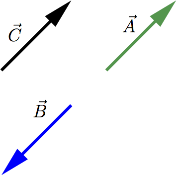
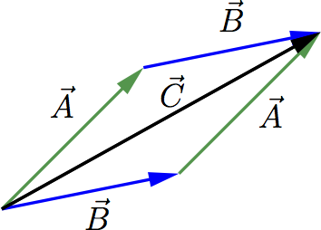
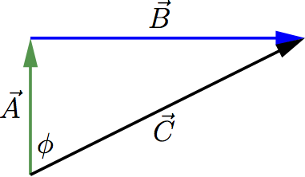
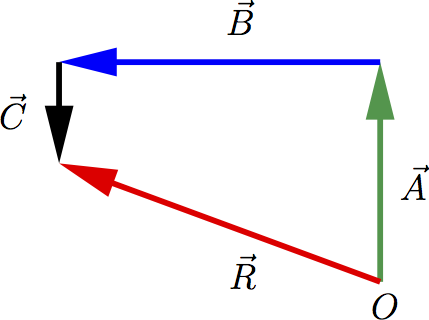
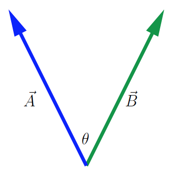
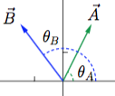
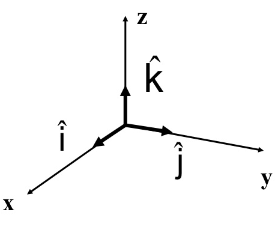

::: {#header}
# Vectores. Análisis Vectorial. {#vectores.-análisis-vectorial. .title}
:::

[Volver a la página principal de Física](https://cursos-0-fc-ugr.github.io/Fisica/)

:::::: section
::: {}
# Propiedades generales de los vectores
:::

En Física, algunas cantidades como el tiempo, la temperatura, la masa y la densidad, se pueden describir completamente con un número y una unidad. Diremos entonces que se trata de **magnitudes escalares**.

Sin embargo, existen otras magnitudes que están asociadas con una dirección y no pueden describirse con un sólo número. Por ejemplo, la velocidad: no solo es necesario indicar la rapidez de un avión, sino también su dirección. También ocurre igual con la magnitud física fuerza: para describirla correctamente, hay que indicar no solo su intensidad, sino también su dirección y sentido. Diremos que son **magnitudes vectoriales**.

**EJEMPLO: [\\({\\overrightarrow{A}}\\)]{.math .inline} y [\\({\\overrightarrow{B}}\\)]{.math .inline} son vectores con la misma magnitud y dirección, pero diferente sentido. El vector [\\({\\overrightarrow{C}}\\)]{.math .inline} tiene la misma dirección que los dos vectores anteriores. Diremos que son vectores paralelos.**

:::: sbsimage
::: imgContainerEnd
[{width="30%"}](figuras/fig-vectores0.png){fancybox=""}
:::
::::

La magnitud de un vector es el *módulo* del vector, y se expresa en la forma [\\(\|{\\overrightarrow{A}}\|\\)]{.math .inline}. Es una cantidad escalar y siempre es positiva.
::::::

:::::::::::::: section
::: {}
# Operaciones con vectores
:::

**Suma de vectores**:

Supongamos que una partícula sufre un desplazamiento del punto [\\(O\\)]{.math .inline} al punto [\\(P\\)]{.math .inline}, definido por el vector [\\({\\overrightarrow{A}}={\\overrightarrow{OP}}\\)]{.math .inline}, seguido de un segundo desplazamiento, del punto [\\(P\\)]{.math .inline} al punto [\\(Q\\)]{.math .inline}, definido entonces por el vector [\\({\\overrightarrow{B}}={\\overrightarrow{PQ}}\\)]{.math .inline}. El resultado final será equivalente a considerar que la partícula parte del punto [\\(O\\)]{.math .inline} y tiene como punto final el punto [\\(Q\\)]{.math .inline}. Es decir, podemos considerar que el desplazamiento total vendrá dado por el vector [\\({\\overrightarrow{C}}\\)]{.math .inline}, que se calcula como [\\\[{\\overrightarrow{C}} = {\\overrightarrow{A }}+{\\overrightarrow{B}} = {\\overrightarrow{B}}+{\\overrightarrow{A}}\\\]]{.math .display}

La suma de vectores es **conmutativa**, tal y como vemos en la siguiente figura

:::: sbsimage
::: imgContainerEnd
[{width="35%"}](figuras/fig-vectores01.png){fancybox=""}
:::
::::

Y además, también es **asociativa**:

[\\\[ {\\overrightarrow{A}}+{\\overrightarrow{B}}+{\\overrightarrow{C}} \\rightarrow \\left ( {\\overrightarrow{A}}+{\\overrightarrow{B}} \\right ) + {\\overrightarrow{C}} = {\\overrightarrow{A}} + \\left ( {\\overrightarrow{B}} + {\\overrightarrow{C}} \\right )\\\]]{.math .display}

Para restar dos vectores:

[\\\[{\\overrightarrow{A}} - {\\overrightarrow{B}} = {\\overrightarrow{A}} + \\left ( -{\\overrightarrow{B}} \\right )\\\]]{.math .display}

[\\((-{\\overrightarrow{B}})\\)]{.math .inline} es el vector opuesto de [\\({\\overrightarrow{B}}\\)]{.math .inline}. Tiene la misma magnitud, la misma dirección, pero sentido contrario.

También podemos multiplicar un vector por un escalar. Por ejemplo:

[\\\[{\\overrightarrow{B}} = 2 \\, {\\overrightarrow{A}}\\\]]{.math .display}

[\\({\\overrightarrow{B}}\\)]{.math .inline} es un vector con la misma dirección y sentido que [\\({\\overrightarrow{A}}\\)]{.math .inline} pero su magnitud es el doble.

La fuerza es una magnitud vectorial. Por tanto, de la expresión

[\\\[ {\\overrightarrow{F}}= m \\, {\\overrightarrow{a}} \\,\\\]]{.math .display}

podemos deducir que la dirección de [\\({\\overrightarrow{F}}\\)]{.math .inline} y [\\({\\overrightarrow{a}}\\)]{.math .inline} es la misma, el sentido también (porque [\\(m\\)]{.math .inline} es siempre una cantidad positiva) y la magnitud de [\\({\\overrightarrow{F}}\\)]{.math .inline} es igual a la magnitud de [\\({\\overrightarrow{a}}\\)]{.math .inline} multiplicada por la masa [\\(m\\)]{.math .inline}.

**EJEMPLO: Un senderista camina desde un refugio en una llanura [\\(1\\)]{.math .inline} km hacia el norte y [\\(2\\)]{.math .inline} km hacia el este. ¿A qué distancia y en qué dirección está respecto al punto de partida?**

Solución

::::: {#sol-e1 style="display:none;"}
Solución:

El camino que sigue el senderista puede ser descrito mediante los vectores [\\({\\overrightarrow{A}}\\)]{.math .inline}, [\\({\\overrightarrow{B}}\\)]{.math .inline} y su resultante [\\({\\overrightarrow{C}}\\)]{.math .inline}, tal y como se representa en la siguiente figura

:::: sbsimage
::: imgContainerEnd
[{width="35%"}](figuras/fig-vectores02.png){fancybox=""}
:::
::::

La distancia al punto de partida la determinaremos mediante la magnitud del vector [\\({\\overrightarrow{C}}\\)]{.math .inline}, que vendrá dada por:

[\\\[\|{\\overrightarrow{C}}\| = \\sqrt{1 + 4} \\; {\\rm km} = \\sqrt{5} \\; {\\rm km} \\, .\\\]]{.math .display}

La dirección nos la dará el ángulo [\\(\\phi\\)]{.math .inline} y por tanto, puede ser calculado teniendo en cuenta la magnitud de los vectores [\\({\\overrightarrow{A}}\\)]{.math .inline} y [\\({\\overrightarrow{B}}\\)]{.math .inline}, [\\(1\\)]{.math .inline} y [\\(2\\)]{.math .inline} km, respectivamente. Por tanto

[\\\[{\\rm tg} \\, \\phi = \\frac{2}{1} \\;\\; \\rightarrow \\phi=63.4\^{\\rm o}\\\]]{.math .display}
:::::

\

**Componentes**

Las componentes de los vectores nos van a permitir un método sencillo pero general para sumar vectores. Supongamos que tenemos un sistema cartesiano de ejes de coordenadas. Entonces [\\(A_x\\)]{.math .inline} es la magnitud del vector [\\({\\overrightarrow{A_x}}\\)]{.math .inline} y [\\(A_y\\)]{.math .inline} es la magnitud del vector [\\({\\overrightarrow{A_y}}\\)]{.math .inline}. [\\(A_x\\)]{.math .inline} y [\\(A_y\\)]{.math .inline} son las componentes del vector [\\({\\overrightarrow{A}}\\)]{.math .inline}. Podemos calcular las componentes del vector [\\({\\overrightarrow{A}}\\)]{.math .inline} si conocemos la magnitud y la dirección de dicho vector. Describiremos la dirección de un vector con su ángulo [\\(\\theta\\)]{.math .inline}, relativo a una dirección de referencia, que es el eje [\\(x\\)]{.math .inline} positivo, siempre en sentido antihorario

[\\\[\\frac{A_x}{\|{\\overrightarrow{A}}\|} = \\cos \\theta \\rightarrow A_x= \|{\\overrightarrow{A}}\| \\cos \\theta \\quad \\quad \\frac{A_y}{\|{\\overrightarrow{A}}\|}= {\\rm sen}\\, \\theta \\rightarrow A_y= \|{\\overrightarrow{A}}\| {\\rm sen} \\, \\theta\\\]]{.math .display}

**EJEMPLO: Determina las componente [\\(x\\)]{.math .inline} e [\\(y\\)]{.math .inline} del vector [\\({\\overrightarrow{D}}\\)]{.math .inline}, con magnitud [\\(\|{\\overrightarrow{D}}\|=3\\)]{.math .inline} m y siendo [\\(\\alpha=45\^{\\rm o}\\)]{.math .inline} (ver figura).**

Solución

::: {#sol-e2 style="display:none;"}
Solución:

Según la figura, vemos que [\\(D_x\\)]{.math .inline} es positiva y [\\(D_y\\)]{.math .inline} es negativa. Por tanto

[\\\[\\cos \\alpha = \\frac{D_x}{\|{\\overrightarrow{D}}\|} \\quad {\\rm sen} \\, \\alpha = \\frac{\|D_y\|}{\|{\\overrightarrow{D}}\|} \\rightarrow D_x=3/2 \\sqrt{2} \\quad D_y=3/2 \\sqrt{2} \\, .\\\]]{.math .display}
:::

\

**Cálculo de vectores usando componentes**

El uso de componentes facilita algunos cálculos que implican vectores. Veamos algunos ejemplos

- *Cálculo y magnitud de un vector a partir de sus componentes*:

  Un vector queda descrito por su magnitud y dirección, pero también dando sus componentes. A partir de ellas, podemos calcular la magnitud y dirección del vector

  [\\\[ \|{\\overrightarrow{A}}\| = \\sqrt{A_x\^2 + A_y\^2} \\quad {\\rm tg} \\, \\theta = \\frac{A_y}{A_x} \\quad \\theta = {\\rm arctg} \\, \\, \\frac{A_y}{A_x}\\\]]{.math .display}

  **EJEMPLO: Calcula la magnitud y dirección del vector [\\({\\overrightarrow{A}}\\)]{.math .inline} si [\\(A_x=2\\)]{.math .inline} m y [\\(A_y=-2\\)]{.math .inline} m.**

  Solución

  ::: {#sol-e3 style="display:none;"}
  Solución:

  [\\\[ \|{\\overrightarrow{A}}\| = \\sqrt{A_x\^2 + A_y\^2} =\\sqrt{8} \\quad \\theta = {\\rm arctg} \\, \\,(-1) \\quad \\theta=315\^{\\rm o}\\\]]{.math .display}

  Al introducir el valor [\\(-1\\)]{.math .inline} en la calculadora para obtener el valor del arco tangente, nos dará [\\(-45\^{\\rm o}\\)]{.math .inline}. Este ángulo, siguiendo nuestro criterio de tomarlo respecto al eje [\\(x\\)]{.math .inline} positivo, en sentido antihorario, es equivalente al ángulo de [\\(315\^{\\rm o}\\)]{.math .inline}.
  :::

  \

- *Multiplicación de un vector por un escalar*:

  [\\\[ {\\overrightarrow{D}}= c {\\overrightarrow{A}} \\rightarrow D_x = c \\, A_x \\quad D_y = c \\, A_y\\\]]{.math .display}

- *Uso de componentes para calcular la suma de vectores*:

  [\\\[ {\\overrightarrow{A}}, {\\overrightarrow{B}} \\quad {\\overrightarrow{R}} = {\\overrightarrow{A}} + {\\overrightarrow{B}} \\rightarrow R_x=A_x+B_x \\quad R_y=A_y+B_y \\, .\\\]]{.math .display}

**EJEMPLO: Un conductor desorientado recorre [\\(3.25\\)]{.math .inline} km hacia el norte, [\\(4.75\\)]{.math .inline} km hacia el oeste y [\\(1.50\\)]{.math .inline} km hacia el sur. Calcular la magnitud y dirección del vector desplazamiento resultante, mediante la suma de las componentes.**

:::: sbsimage
::: imgContainerEnd
[{width="35%"}](figuras/fig-vectores1.png){fancybox=""}
:::
::::

Solución

::: {#sol-e4 style="display:none;"}
Solución:

Teniendo en cuenta las componentes (expresadas en km):

[\\\[ A_x=0 \\;\\; A_y=3.25 \\quad B_x=-4.75 \\, \\, B_y= 0 \\quad C_x= 0 \\;\\; C_y=-1.50\\\]]{.math .display}

Por tanto

[\\\[ R_x=A_x+B_x+C_x=-4.75 \\quad R_y=A_y+B_y+C_y=1.75 \\, .\\\]]{.math .display}
:::

**EJEMPLO: El vector [\\({\\overrightarrow{A}}\\)]{.math .inline} tiene componentes [\\(A_x=1.30\\)]{.math .inline} cm. [\\(A_y=2.25\\)]{.math .inline} cm. El vector [\\({\\overrightarrow{B}}\\)]{.math .inline} tiene componentes [\\(B_x=4.10\\)]{.math .inline} cm y [\\(B_y=-3.75\\)]{.math .inline} cm. Calcular:**

1.  Las componentes de la resultante [\\({\\overrightarrow{R}}={\\overrightarrow{A}}+{\\overrightarrow{B}}\\)]{.math .inline}.

2.  La magnitud y la dirección de [\\({\\overrightarrow{R}}={\\overrightarrow{A}}+{\\overrightarrow{B}}\\)]{.math .inline}.

3.  Las componentes de la diferencia vectorial [\\({\\overrightarrow{S}}={\\overrightarrow{B}}-{\\overrightarrow{A}}\\)]{.math .inline}.

4.  La magnitud y la dirección de [\\({\\overrightarrow{S}}={\\overrightarrow{B}}-{\\overrightarrow{A}}\\)]{.math .inline}.

Solución

::: {#sol-e5 style="display:none;"}
Solución:

1.  [\\\[ R_x=A_x+B_x=5.40 \\; {\\rm cm} \\quad \\quad R_y=A_y+B_y=-1.50 \\; {\\rm cm}\\\]]{.math .display}

2.  [\\\[\|{\\overrightarrow{R}}\|=\\sqrt{(5.40)\^2 + (1.50)\^2} \\; {\\rm cm} = 5.60 \\; {\\rm cm} \\quad \\quad {\\rm tg} \\; \\phi= \\frac{-1.50}{5.40} \\rightarrow \\phi=285.52\^{\\rm o}\\\]]{.math .display}

3.  [\\\[S_x=B_x-A_x=2.80 \\; {\\rm cm} \\quad \\quad S_y=B_y-A_y=-6.00 \\; {\\rm cm}\\\]]{.math .display}

4.  [\\\[\|{\\overrightarrow{S}}\|=\\sqrt{(2.80)\^2 + (6.00)\^2} \\; {\\rm cm} = 6.62 \\; {\\rm cm} \\quad \\quad {\\rm tg} \\; \\psi= \\frac{-6.00}{2.80} \\rightarrow \\psi=115.02\^{\\rm o}\\\]]{.math .display}
:::
::::::::::::::

::::: section
::: {}
# Vectores unitarios
:::

Los vectores unitarios son aquéllos con magnitud igual a [\\(1\\)]{.math .inline} (sin unidades). Su única finalidad es dar una dirección en el espacio. Siempre los notaremos con un acento del tipo [\\(\\hat{ }\\)]{.math .inline}, para indicar que se trata de un vector unitario.

- [\\(\\hat{\\imath}\\)]{.math .inline} [\\(\\rightarrow\\)]{.math .inline} apunta en la dirección [\\(x\\)]{.math .inline} positiva.

- [\\(\\hat{\\jmath}\\)]{.math .inline} [\\(\\rightarrow\\)]{.math .inline} apunta en la dirección [\\(y\\)]{.math .inline} positiva

Por tanto, podemos escribir:

[\\\[{\\overrightarrow{A}}= A_x \\, \\hat{\\imath} \\, + \\, A_y \\, \\hat{\\jmath} \\, .\\\]]{.math .display}

Y la suma de vectores se haría sumando directamente componentes: [\\\[\\vec{A}=A_x \\, \\hat{\\imath} \\, + \\, A_y \\, \\hat{\\jmath} \\quad \\quad \\quad \\vec{B}=B_x \\, \\hat{\\imath} \\, + \\, B_y \\, \\hat{\\jmath} \\quad \\quad \\quad {\\overrightarrow{R}}= {\\overrightarrow{A}}+{\\overrightarrow{B}}=\\left ( A_x+B_x \\right) \\hat{\\imath} + \\left (A_y+B_y \\right) \\hat{\\jmath}\\\]]{.math .display}

**EJEMPLO: Sean los vectores [\\({\\overrightarrow{D}}= \\left ( 6 \\hat{\\imath} + 3\\hat{\\jmath} \\right )\\, {\\rm m}\\)]{.math .inline} y [\\({\\overrightarrow{E}}= \\left ( 4 \\hat{\\imath} - 5 \\hat{\\jmath} \\right ) \\, {\\rm m}\\)]{.math .inline}. Calcular el vector [\\(2 {\\overrightarrow{D}} - {\\overrightarrow{E}}\\)]{.math .inline} y su magnitud.**

Solución

::: {#sol-e6 style="display:none;"}
Solución:

[\\\[ {\\overrightarrow{R}} = 2\\, {\\overrightarrow{D}} -{\\overrightarrow{E}} = 2 \\, \\left ( 6 \\hat{\\imath} + 3 \\hat{\\jmath} \\right ) - \\left ( 4 \\hat{\\imath} - 5 \\hat{\\jmath} \\right ) = 12 \\hat{\\imath} + 6 \\hat{\\jmath} - 4\\hat{\\imath} + 5 \\hat{\\jmath} = \\left ( 8 \\hat{\\imath} + 11 \\hat{\\jmath} \\right ) \\, { \\rm m} \\, .\\\]]{.math .display}

Y la magnitud del vector [\\({\\overrightarrow{R}}\\)]{.math .inline} será:

[\\\[ \|{\\overrightarrow{R}}\|= \\sqrt{64 \\, +\\, 121} = \\sqrt{185} \\, {\\rm m} = 13.6 \\, {\\rm m}\\\]]{.math .display}
:::
:::::

::::::::::::: section
::: {}
# Producto de vectores
:::

**Producto escalar de dos vectores**:\

Se denota por [\\({\\overrightarrow{A}} \\cdot {\\overrightarrow{B}}\\)]{.math .inline} y el resultado es un escalar. Para calcularlo, representamos los vectores [\\({\\overrightarrow{A}}\\)]{.math .inline} y [\\({\\overrightarrow{B}}\\)]{.math .inline} con origen en el mismo punto.

:::: sbsimage
::: imgContainerEnd
[{width="35%"}](figuras/fig-vectores03.png){fancybox=""}
:::
::::

Definimos [\\({\\overrightarrow{A}} \\cdot {\\overrightarrow{B}}\\)]{.math .inline} como la magnitud de [\\({\\overrightarrow{A}}\\)]{.math .inline} multiplicada por la componente de [\\({\\overrightarrow{B}}\\)]{.math .inline} paralela a [\\({\\overrightarrow{A}}\\)]{.math .inline}, es decir:

[\\\[\\fbox{\${\\overrightarrow{A}} \\cdot {\\overrightarrow{B}} = \|{\\overrightarrow{A}}\|\\, \|{\\overrightarrow{B}}\| \\, {\\rm cos} \\, \\theta\$ }\\\]]{.math .display}

Es un escalar, y puede ser positivo, negativo o cero. Si [\\(\\theta= \\pi /2\\)]{.math .inline} (vectores perpendiculares) el producto escalar es siempre cero, independientemente de la magnitud de los vectores. También podemos comprobar que el producto escalar es **conmutativo**:

[\\\[{\\overrightarrow{A}} \\cdot {\\overrightarrow{B}} = \|{\\overrightarrow{A}}\| \\, \|{\\overrightarrow{B}}\| \\, {\\rm cos} \\, \\theta= \|{\\overrightarrow{B}}\| \\, \|{\\overrightarrow{A}}\| \\, {\\rm cos} \\, \\theta = {\\overrightarrow{B}} \\cdot {\\overrightarrow{A}}\\\]]{.math .display}

Por ejemplo, si una fuerza constante [\\(\\vec{F}\\)]{.math .inline} se aplica a un cuerpo que sufre un desplazamiento [\\(\\vec{s}\\)]{.math .inline}, el trabajo [\\(W\\)]{.math .inline} realizado por la fuerza se calculará como

[\\\[\\fbox{\$W = {\\overrightarrow{F}} \\cdot {\\overrightarrow{s}} \$ }\\\]]{.math .display}

Si queremos usar las componentes para calcular el producto escalar de los vectores [\\({\\overrightarrow{A}}\\)]{.math .inline} y [\\({\\overrightarrow{B}}\\)]{.math .inline}

[\\\[{\\overrightarrow{A}}= A_x \\hat{\\imath} + A_y \\hat{\\jmath} \\quad \\; {\\overrightarrow{B}}= B_x \\hat{\\imath} + B_y \\hat{\\jmath} \\,\\\]]{.math .display}

tendremos: [\\\[\\vec{A} \\cdot \\vec{B} = \\left ( A_x \\hat{\\imath} + A_y \\hat{\\jmath} \\right ) \\cdot \\left ( B_x \\hat{\\imath} + B_y \\hat{\\jmath} \\right ) = A_x \\, B_x + A_y \\, B_y \\, ,\\\]]{.math .display} donde hemos usado que se verifica que: [\\\[\\hat{\\imath} \\cdot \\hat{\\imath} = \\hat{\\jmath} \\cdot \\hat{\\jmath}= 1 \\quad \\; \\hat{\\imath} \\cdot \\hat{\\jmath} = \\hat{\\jmath} \\cdot \\hat{\\imath} = 0\\\]]{.math .display}

EJEMPLO: Obtener el producto escalar de los vectores [\\({\\overrightarrow{A}}\\)]{.math .inline} y [\\({\\overrightarrow{B}}\\)]{.math .inline}, siendo [\\(\|{\\overrightarrow{A}}\|=4\\)]{.math .inline}, [\\(\\theta_A=53\^{\\rm o}\\)]{.math .inline} y [\\(\|{\\overrightarrow{B}}\|=5\\)]{.math .inline}, [\\(\\theta_B=130\^{\\rm o}\\)]{.math .inline} [^1^](#fn1){#fnref1 .footnoteRef}

:::: sbsimage
::: imgContainerEnd
[{width="100%"}](figuras/fig-vectores04.png){fancybox=""}
:::
::::

Solución

::: {#sol-e7 style="display:none;"}
Solución:

Podemos calcular las componentes de cada uno de los vectores: [\\\[A_x= \|{\\overrightarrow{A}}\| \\cos 53\^{\\rm o} = 2.407 \\quad \\; A_y = \|{\\overrightarrow{A}}\| {\\rm sen} 53\^{\\rm o}=3.195\\\]]{.math .display}

[\\\[B_x= \|{\\overrightarrow{B}}\| \\cos 130\^{\\rm o} = -3.214 \\quad \\; B_y = \|{\\overrightarrow{B}}\| {\\rm sen} 130\^{\\rm o}=3.830 \\, .\\\]]{.math .display}

Por tanto:

[\\\[ {\\overrightarrow{A}} \\cdot {\\overrightarrow{B}} = A_x \\, B_x \\, + \\, A_y \\, B_y = 4.499 \\, .\\\]]{.math .display}
:::

**EJEMPLO: Determinar el ángulo de los vectores [\\({\\overrightarrow{A}} = 2 \\hat{\\imath} + 3 \\hat{\\jmath}\\)]{.math .inline} y [\\({\\overrightarrow{B}} = -4 \\hat{\\imath} + 2 \\hat{\\jmath} \\, .\\)]{.math .inline}**

Solución

::: {#sol-e8 style="display:none;"}
Solución:

Usando la definición de producto escalar:

[\\\[ {\\overrightarrow{A}} \\cdot {\\overrightarrow{B}} = -8 + 6 = -2 = \|{\\overrightarrow{A}}\| \\, \|{\\overrightarrow{B}}\| \\, \\cos{\\theta}\\\]]{.math .display}

Pero: [\\\[\|{\\overrightarrow{A}}\| = \\sqrt{4 +9}=\\sqrt{13} \\quad \\; \|{\\overrightarrow{B}}\|= \\sqrt{16+4}= \\sqrt{20} \\, .\\\]]{.math .display}

Por tanto: [\\\[ -2 = \|{\\overrightarrow{A}}\| \\, \|{\\overrightarrow{B}}\| \\, \\cos{\\theta} = \\sqrt{13} \\, \\sqrt{20} \\cos{\\theta} \\; \\rightarrow \\; \\theta = {\\rm arc \\, cos} \\left (\\frac{-2}{\\sqrt{260}} \\right ) = 97.125\^{\\rm o}\\\]]{.math .display}
:::

\

**Producto vectorial de dos vectores**:\

El producto vectorial de los vectores [\\({\\overrightarrow{A}}\\)]{.math .inline} y [\\({\\overrightarrow{B}}\\)]{.math .inline} se denota como [\\({\\overrightarrow{A}} \\wedge {\\overrightarrow{B}}\\)]{.math .inline}. Definimos dicho producto vectorial como un vector, perpendicular al plano que forman los vectores [\\({\\overrightarrow{A}}\\)]{.math .inline} y [\\(\\vec{B}\\)]{.math .inline}, y cuya magnitud viene dada por [\\\[\|{\\overrightarrow{A}} \\wedge {\\overrightarrow{B}}\| = \|{\\overrightarrow{A}}\| \\, \|{\\overrightarrow{B}}\| \\, {\\rm sen} \\theta \\, ,\\\]]{.math .display} siendo [\\(\\theta\\)]{.math .inline} el ángulo que forman ambos vectores. La dirección y sentido del vector [\\({\\overrightarrow{A}} \\wedge {\\overrightarrow{B}}\\)]{.math .inline} nos lo da la *regla de la mano derecha*. La dirección del producto vectorial está definida por la dirección del pulgar, cerrando los demás dedos en torno al vector [\\({\\overrightarrow{A}}\\)]{.math .inline} primero y siguiendo con el vector [\\({\\overrightarrow{B}}\\)]{.math .inline}.

Una propiedad del producto vectorial es que cuando ambos vectores son paralelos ([\\(\\theta=0\\)]{.math .inline}, [\\(180\^{\\rm o}\\)]{.math .inline}), el producto vectorial es nulo.

Teniendo en cuenta los vectores unitarios en el espacio tridimensional:

:::: sbsimage
::: imgContainerEnd
[{width="50%"}](figuras/unitarios.png){fancybox=""}
:::
::::

Podemos ver que verifican: [\\\[\\hat{\\imath} \\wedge \\hat{\\jmath} = \\hat{k} \\quad \\; \\hat{\\jmath} \\wedge \\hat{\\imath} = -\\hat{k} \\quad \\; \\hat{\\imath} \\wedge \\hat{\\imath} = 0\\\]]{.math .display}

[\\\[\\hat{\\jmath} \\wedge \\hat{k} = \\hat{\\imath} \\quad \\; \\hat{k} \\wedge \\hat{\\jmath} = -\\hat{\\imath} \\quad \\; \\hat{\\jmath} \\wedge \\hat{\\jmath} = 0\\\]]{.math .display}

[\\\[\\hat{k} \\wedge \\hat{\\imath} = \\hat{\\jmath} \\quad \\; \\hat{\\imath} \\wedge \\hat{k} = -\\hat{\\jmath} \\quad \\; \\hat{k} \\wedge \\hat{k} = 0\\\]]{.math .display}

Y esto nos sirve para escribir una expresión general para el producto vectorial [\\({\\overrightarrow{A}} \\wedge {\\overrightarrow{B}}\\)]{.math .inline}:

[\\\[{\\overrightarrow{A}} \\wedge {\\overrightarrow{B}} = \\left ( A_x \\hat{\\imath} + A_y \\hat{\\jmath} + A_z \\hat{k} \\right ) \\wedge \\left (B_x \\hat{\\imath} + B_y \\hat{\\jmath} + B_z \\hat{k} \\right ) = \\left ( A_y\\, B_z\\, -\\, A_z\\, B_y \\right)\\hat{\\imath} + \\left ( A_z\\, B_x\\, -\\, A_x\\, B_z \\right)\\hat{\\jmath} + \\left ( A_x\\, B_y\\, -\\, A_y\\, B_x \\right)\\hat{k} \\,\\\]]{.math .display}

que puede escribirse en forma más sencilla como un determinante:

[\\\[ {\\overrightarrow{A}} \\wedge {\\overrightarrow{B}} = \\left \| \\begin{matrix} \\hat{\\imath} & \\hat{\\jmath} & \\hat{k} \\\\ A_x & A_y & A_z \\\\ B_x & B_y & B_z \\end{matrix} \\right \|\\\]]{.math .display}

**EJEMPLO: Sea [\\({\\overrightarrow{A}}= 6 \\, \\hat{\\imath}\\)]{.math .inline} y [\\({\\overrightarrow{B}}= 4 \\left ( \\cos 30\^{\\rm o} \\, \\hat{\\imath} + {\\rm sen} \\, 30\^{\\rm o} \\, \\hat{\\jmath} \\right )\\)]{.math .inline}. Calcula [\\({\\overrightarrow{A}} \\wedge {\\overrightarrow{B}}\\)]{.math .inline}.**

Solución

::: {#sol-e9 style="display:none;"}
Solución:

[\\\[{\\overrightarrow{A}} \\wedge {\\overrightarrow{B}} = 24 \\cdot {\\rm sen} \\, 30\^{\\rm o} \\, \\hat{k} = 12 \\, \\hat{k}\\\]]{.math .display}
:::
:::::::::::::

[Test para repasar análisis vectorial](vectores-test.html)\
\
[Volver a la página principal de Física](https://cursos-0-fc-ugr.github.io/Fisica/)\
\

::: footnotes

------------------------------------------------------------------------

1.  ::: {#fn1}
    Los angulos [\\(\\theta_A\\)]{.math .inline} y [\\(\\theta_B\\)]{.math .inline} se refieren al ángulo que forma cada uno de los vectores con el eje [\\(x\\)]{.math .inline} positivo.[↩](#fnref1)
    :::
:::
