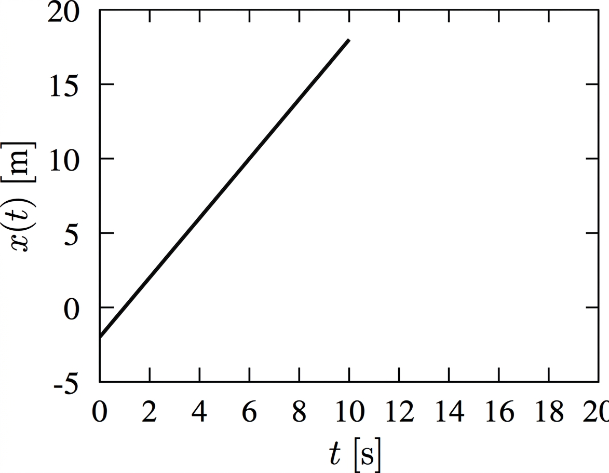
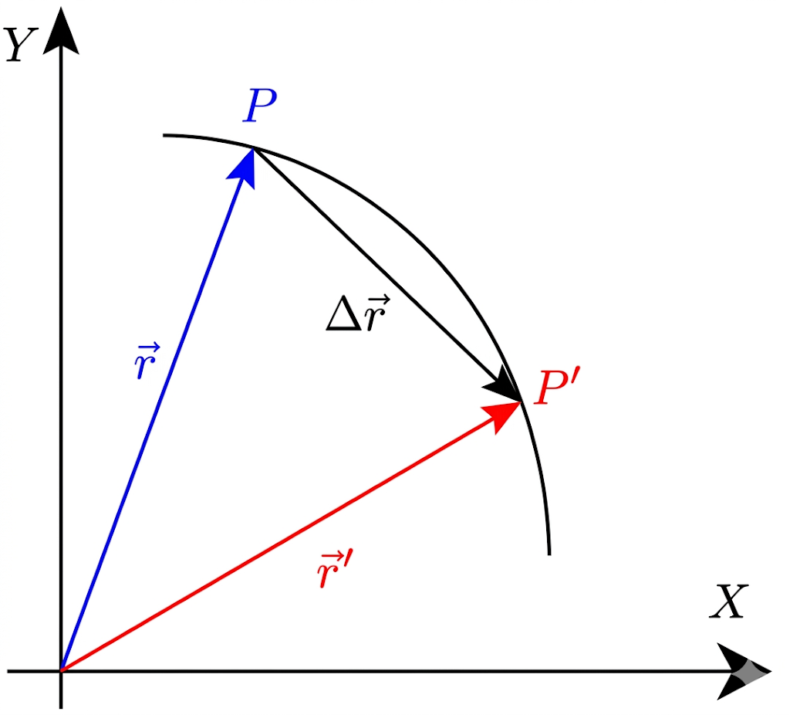
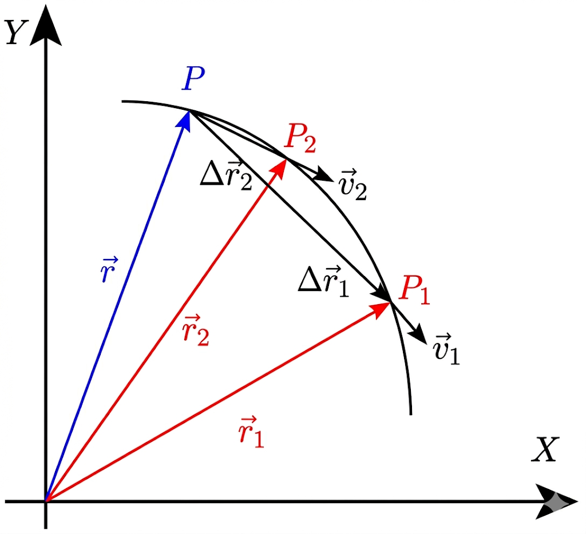
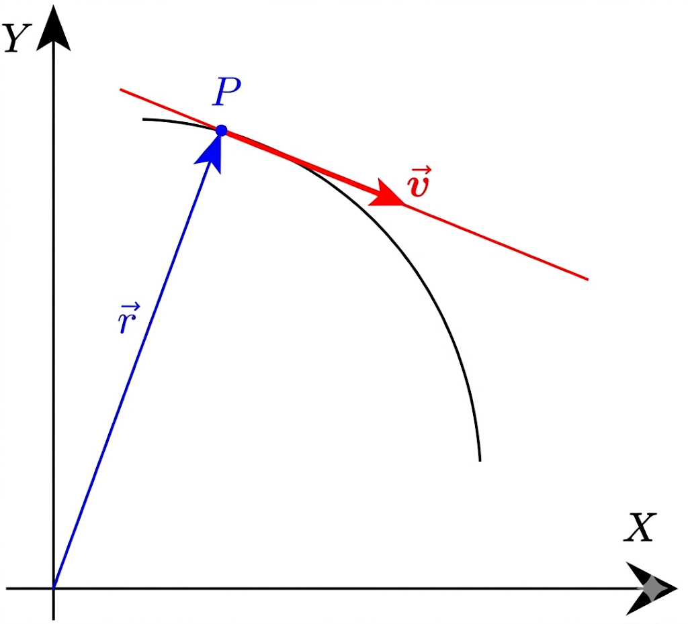
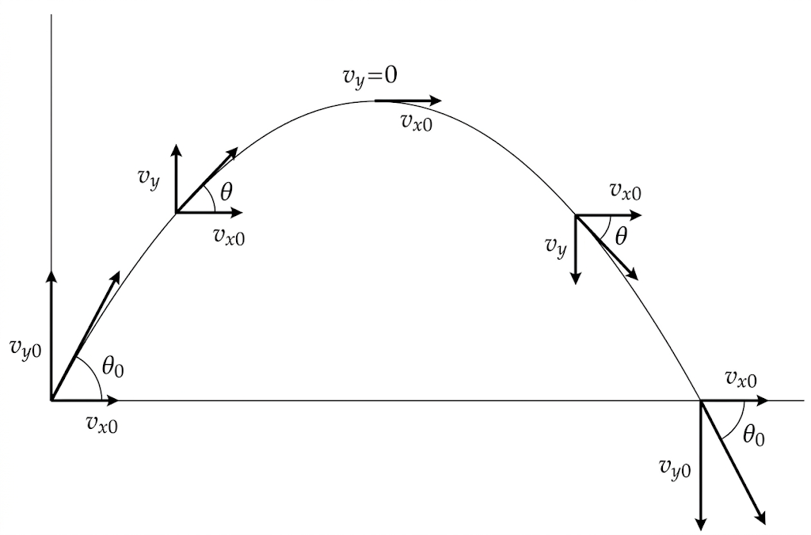

# 1. Cinemática de la partícula en una dimensión {#Cinemática-de-la-partícula-en-una-dimensión}

## 1.1. Introducción

El fenómeno físico más obvio y fundamental es el movimiento. La *Mecánica* (ciencia del movimiento) es la rama de la Física que estudia los movimientos y las fuerzas que las producen. Atendiendo a la naturaleza de su contenido, la Mecánica se divide en dos partes:

1.  **Cinemática**, o teoría geométrica del movimiento.

2.  **Dinámica**, o estudio de las relaciones existentes entre las fuerzas y los movimientos que éstos producen.

En este tema nos centraremos en la Cinemática, más concretamente en el caso particular de una dimensión. Los elementos básicos de la cinemática son 
$$\fbox{móvil, espacio, tiempo}$$

El móvil más simple que podemos considerar es el punto material (partícula). La partícula es una idealización de los cuerpos que existen en la Naturaleza. Entendemos por **punto material o partícula** un cuerpo de dimensiones tan pequeñas que pueda considerarse como puntiforme; de ese modo, su posición en el espacio quedará determinada al fijar las coordenadas de un punto geométrico. Naturalmente, la posibilidad de despreciar las dimensiones de un cuerpo estará en relación con las condiciones específicas del problema considerado. Por ejemplo, podemos considerar la Tierra como un punto material si sólo estamos interesados en su movimiento alrededor del Sol, pero no cuando estemos interesados en el movimiento de la Tierra alrededor de su propio eje.

Dado un punto material, con una cierta masa inercia, se precisará un cierto esfuerzo para modificar su estado de movimiento. Llamaremos **fuerza** a cualquier agente capaz de modificar el estado de movimiento de los cuerpos.

## 1.2.Desplazamiento, velocidad, módulo de la velocidad

Dado que estamos por el momento trabajando en una dimensión no hace falta notación vectorial, solo $+$ ó $-$ para indicar el sentido del movimiento.

**Posición y desplazamiento**

La descripción del movimiento consiste en saber la posición de una partícula y cómo ésta cambia con el movimiento de la partícula. En un movimiento en una dimensión se suele escoger el eje $x$ a lo largo de la línea por la que discurre el movimiento.

:::{.callout-note title="Ejemplo:" collapse="false" icon="false"}

$$x (t_i) \, ----------------------------------------\, x(t_f)$$

:::

Distinguiremos ahora entre dos conceptos, *desplazamiento* y *distancia recorrida*. La *distancia recorrida* es la longitud que un partícula sigue desde su posición inicial a su posición final. Es, por tanto, una magnitud escalar siempre positiva. Por otra parte, el *desplazamiento* es el cambio en la posición de la partícula. Será positivo si la partícula va en la dirección de $x$ positiva y negativo si va en la dirección de $x$ negativa.

::::{.callout-note title="Ejemplo:" collapse="false" icon="false"}
Sacamos nuestro perro a pasear y le lanzamos un palo en línea recta a $5$ m de distancia. El perro corre, alcanza
el palo y regresa con él en la boca, recorriendo $3\text{ m}$. Entonces se para y se echa al suelo.

1.  ¿Cuál es la distancia total que recorre el perro?

2.  ¿Cuál es el desplazamiento neto?

:::{.callout-note title="Solución:" collapse="true" icon="false"}

1.  El perro ha recorrido como distancia total $5+3=8\text{ m}$.

2.  Llamemos $t_0$ al instante inicial. Para ese tiempo, supongamos que la posición del perro es $x(t_0)=0$ m. Sea $t_1$ el instante en el que el perro alcanza el palo. Para ese instante entonces, tendremos que $x(t_1)=5\text{ m}$. Finalmente, sea $t_3$ el instante de tiempo en el que el perro se para. En ese instante, la posición respecto al punto inicial será $x(t_3)=2\text{ m}$. Por tanto, el desplazamiento neto será: $$\Delta x= x(t_3)-x(t_0)= 2 \text { m}$$
:::

::::

**Velocidad media**

La velocidad media, en la dirección del eje $x$, $v_{m,x}$, se define como la razón entre el desplazamiento sobre el eje $x$ y el intervalo de tiempo $t$:

$$v_{m}= \frac{\Delta x}{\Delta t} = \frac{x(t_f)-x(t_i)}{t_f-t_i} \quad \quad \Delta x = v_{m} \Delta t$$

La velocidad media puede ser positiva o negativa, al igual que el desplazamiento. Sus dimensiones serán L/T, y sus unidades en el SI $\text{m/s}$.

::::{.callout-note title="Ejemplo:" collapse="false" icon="false"}
Se tardan $10\text{ m}$ de casa al conservatorio ($5\text{ km}$) en línea recta. Un día salimos $15\text{ m}$ antes del comienzo de la clase y nos encontramos con un semáforo estropeado que hace que la velocidad durante los $2$ primeros $\text{km}$ sea de $20\text{ km/h}$. ¿Llegaremos a tiempo a clase?

:::{.callout-note title="Solución:" collapse="true" icon="false"}

- Velocidad durante el 1$^{\text{er}}$ tramo $\rightarrow$ $20\text{ km/h}$ $\rightarrow$ $2\text{ km}$

- Velocidad en los últimos $3\text{ km}$  $\rightarrow$ ${\displaystyle \frac{5 \text{ km}}{10 \text{ m}/60 \text{ m} \times 1 \text{ h}} = 30 \text{ km}}$

- Distancia recorrida en el primer tramo $\rightarrow$ $2\text{ km}$ $\rightarrow$¿tiempo?

  $$\Delta t_1 = \frac{ 2 \text{ km}}{20 \text{ km/h}} =   \frac{1}{10} \text{ h} = 6 \text{ min}$$

  En el segundo tramo:

  $$3\text{ km a }30\text{ km/h}\ \rightarrow\ \Delta t_2 =  \frac{3\text{ km}}{30\text{ km/h}} = \frac{1}{10}\text{ h} = 6 \text{ min} $$

Por tanto, el tiempo total que tardamos en llegar al conservatorio es $\Delta t = \Delta t_1 + \Delta t_2=6 \text{ min} + 6\text{ min} = 12 \text{ min}$. Llegamos entonces a tiempo, y nos sobran $3\text{ min}$ antes del comienzo delas clases.
:::

::::

**Velocidad instantánea y módulo de la velocidad**:

La velocidad instantánea es el límite de la relación $\Delta x/\Delta t$ cuando $\Delta t$ se aproxima a cero:

$$v(t) = \lim\limits_{\Delta t \rightarrow 0} \frac{\Delta x}{\Delta t} = \frac{ d x }{d t }$$

Por tanto, podemos decir que la velocidad instantánea en el tiempo $t$ es la derivada de la función posición, $x(t)$, respecto al tiempo. Este valor puede ser positivo, negativo o nulo; en un movimiento unidimensional, la velocidad instantánea puede ser positiva ($x$ creciente, negativa ($x$ decreciente) o nula (no hay movimiento). En un objeto que se mueve a velocidad constante, la velocidad instantánea coincide con la velocidad media, y tendremos que la gráfica de la posición en función del tiempo será

:::{style="text-align:center;"}
{width="35%"}
:::

La velocidad instantánea es un vector, por lo que a veces podemos hablar del *módulo* de la velocidad instantánea.

::::{.callout-note title="Ejemplo:" collapse="false" icon="false"}
Supongamos una piedra que, partiendo del reposo, se deja caer desde un acantilado de altura $h$. Se puede demostrar que la posición (vertical) de la piedra, en cualquier instante de tiempo, viene dada por: $$x(t) = h - 5t^2 $$ Calcular la velocidad de la piedra en cualquier instante de tiempo.

:::{.callout-note title="Solución:" collapse="true" icon="false"}

Tendremos que calcular: 
$$v(t) = \frac{ dx } { dt } = -10 t$$ 

y esa es la expresión de la velocidad en cualquier instante de tiempo $t$.
:::

::::

## 1.3. Aceleración:

La aceleración es la tasa de cambio de la velocidad. Podemos definir la aceleración media, a partir de la velocidad media, o la aceleración
instantánea, a partir de la velocidad instantánea:

- Aceleración media:

  $$a_m = \frac{\Delta v_{m}}{\Delta t} =  \frac{v(t_1)-v(t_0)}{t_1-t_0} $$

- Aceleración instantánea:

  $$a(t) = \lim\limits_{\Delta t \rightarrow 0} \frac{\Delta v(t) }{\Delta t} = \frac{ d^2 x }{d t^2} $$

::::{.callout-note title="Ejemplo:" collapse="false" icon="false"}
Un guepardo puede acelerar de $0$ a $100\text{ km/h}$ en $2\text{ s}$, mientras que una moto requiere $5\text{ s}$. Calcular las aceleraciones medias del guepardo y de la moto, y compararlas con la aceleración de caída libre debido a la gravedad (g$=9.81$\text{ m/s$^2$}).

:::{.callout-note title="Solución:" collapse="true" icon="false"}

- Guepardo:

  $$a_m= \frac{100\text{ km/h} }{2\text{ s}\frac{1\text{ h}}{3600\text{ s}}} = 180000 \text{ km/h}^2= 13.9\text{ m/s}^2$$

- Moto:

  $$a_m= \frac{100\text{ km/h} }{5\text{ s}\frac{1\text{ h}}{3600\text{ s}}} = 72000\text{ km/h}^2 = 5.6\text{ m}/\text{ s}^2$$

Por tanto, la aceleración del guepardo y de la moto, comparados con $g$, será:

- Guepardo:

  $$\frac{13.8\text{ m/s}^2}{9.81\text{ m/s}^2}= 1.41 \ \rightarrow \ a_\text{guep}= 1.41g$$

- Moto:

  $$\frac{5.6\text{ m/s}^2}{9.81\text{ m/s}^2}= 0.57 \ \rightarrow \ a_\text{moto} = 0.57g$$
:::

::::

::::{.callout-note title="Ejemplo:" collapse="false" icon="false"}
La posición de un partícula en función del tiempo viene dada por: 
$$x(t) = C t^3\ ,$$
siendo $C$ una constante cuyas unidades son $\text{m/s}^3$. Hallar la velocidad y la aceleración en función del tiempo.

:::{.callout-note title="Solución:" collapse="true" icon="false"}

Para ello, solo tendremos que derivar la expresión de la posición para obtener la velocidad y, una vez obtenida esta última, derivarla de nuevo
para obtener la aceleración:

$$v(t)= \frac{ dx} { dt} = 3C t^2 \ \ a(t) = \frac{ d^2 x }{ d t^2} = 6 Ct$$
:::
::::

# 2. Movimiento con aceleración constante

Sabemos que en general:
$$a = \frac{ d v} { d t}$$

Integrando:

$${d v} = a d t \rightarrow \int_{t_0}^t d v = \int_{t_0}^t a d t = a\int_{t_0}^t d t =  a \left ( t-t_0 \right )$$

Por tanto:

$$ v(t)= v(t_0) + a (t-t_0)$$

Si $t_0=0$ y llamamos $v(t_0)=v_0$, resulta:

$$\fbox{ $v(t) = v_0 + a t $}$$

Pero también sabemos que

$$ \frac{d x(t)}{d t} = v(t)= v(t_0) + a \left ( t - t_0 \right )$$

$$d x(t) = v(t_0) d t + a \left ( t-t_0 \right ) d t$$

Integrando:

$$ \int_{t_0}^t d x = v(t_0) \int_{t_0}^t d t + a \int_{t_0}^t \left (t-t_0 \right ) d t$$

Por tanto, obtenemos como ecuación general que nos da la posición en el tiempo $t$, $x(t)$, con el tiempo $t$ y la aceleración $a$, del siguiente modo:

$$x(t)= x(t_0) + v(t_0) (t-t_0) + a \frac{(t-t_0)^2}{2}$$

Si $t_0=0$, $x(t_0)=x_0$ y $v(t_0)=v_0$, podemos escribir finalmente:

$$\fbox{ $x(t) =  x_0 +  v_0 t + a  \frac{t^2}{2} $}$$

Si en la ecuación general obtenida la velocidad $v(t)$, despejamos $(t-t_0)$, tendremos:

$$ v(t) = v(t_0) + a (t-t_0) \ \rightarrow \ \left ( t-t_0 \right ) = \frac{v(t) -v(t_0) }{ a }$$

Y si ahora, sustituimos esta cantidad en la ecuación de la posición $x(t)$, resulta:

$$x(t)= x(t_0) + v(t_0)  (t-t_0) + a \frac{(t-t_0)^2}{2} \ \rightarrow \ x(t) = x(t_0) + \frac{v(t_0)}{a} \left (v(t)-v(t_0) \right ) + \frac{a}{2 a^2} \left (v(t)-v(t_0) \right)^2$$

$$ x(t)=x(t_0) + \frac{1}{2¡ a} \left (v(t) - v(t_0) \right ) \left (v(t_0) + v(t) \right ) =x(t_0) + \frac{1}{2 a} \left (v(t)^2 - v(t_0)^2 \right )$$

Definiendo el desplazamiento $\Delta x(t)= x(t)-x(t_0)$, podemos escribir finalmente:

$$\fbox{ $v(t)^2 =  v(t_0)^2  +  2 a  \Delta x(t) $}$$

::::{.callout-note title="Ejemplo:" collapse="false" icon="false"}
Una persona conduce un vehículo de noche por una autovía. De pronto, a una cierta distancia, ve un coche parado. Entonces, frena
hasta detenerse con una aceleración de $5\text{m/s}^2$. Determina la distancia de frenado si su velocidad inicial es

1.  $15\text{ m/s}$.

2.  $30\text{ m/s}$.

:::{.callout-note title="Solución:" collapse="true" icon="false"}

Suponemos $t_0=0$, $x(t_0)=0$ y sabemos además que $v(t_0)=15\text{ m/s}$ y que $v(t)=0$ (puesto que queremos que el vehículo se detenga) y $a=-5\text{ m/s}^2$ (el signo $-$ es porque estamos frenando).

Para determinar la distancia de frenado, podemos usar la fórmula obtenida anteriormente:

$$ v(t)^2 = v(t_0)^2 + 2  a  \Delta x(t) \rightarrow 0 = \left ( 15 \text{ m/s} \right ) ^2 - 2 \cdot 5 \text{ m/s}^2 \Delta x(t)$$

Por tanto, se obtiene que la distancia de frenado, $\Delta x(t)=22.5\text{ m}$.

Haciendo la misma operación, obtenemos que $\Delta x(t)=90\text{ m}$.

En este segundo caso, ¿cuánto tarda el coche en detenerse?

Para calcularlo, podemos hacer uso de la ecuación que nos da la velocidad final en términos del tiempo, de la aceleración y de la velocidad inicial. Puesto que $t_0=0$, podemos escribir:

$$v(t) = v(t_0) + a t\ \rightarrow 0 \ \text{ m/s} = 30\text{ m/s} - 5 \text{ m/s}^2t \ \rightarrow \ t= 6\text{ s}$$

¿Qué distancia recorre el coche durante el último segundo?

Dado que tarda $6$ segundos en pararse, la distancia que recorre el coche en el último segundo será la que transcurre entre $t_1=5\text{ s}$ y $t=6\text{ s}$. Aplicamos la fórmula:

$$ \Delta x (t) = v(t_1) \left (t-t_1 \right ) + \frac{a}{2} \left (t - t_1 \right ) ^2$$

Para conocer $v(t_0)$, necesitamos saber qué velocidad tenía el vehículo en el instante $t_1=5\text{ s}$. Sabiendo que para $t_0=0$, $v(t_0)=30\text{ m/s}$, podemos escribir:

$$v(t_1)= v(t_0) + a \left ( t_1 - t_0 \right )\  \rightarrow v(t_1) = 30 \text{m/s}-5\text{ m/s}^2 \cdot 5 \text{ s} = 5 \text{ m/s}$$

Sustituyendo este resultado en la ecuación de arriba, tendremos:

$$ \Delta x(t) = 5 \text{ m/s} \left (6 \text{ s} - 5\text{ s} \right ) - \frac{ 5 \text{ m/s}^2 } {2} \left ( 6\text{ s} - 5 \text{ s} \right )^2 = 2.5\text{ m}$$

:::

::::

::::{.callout-note title="Ejemplo:" collapse="false" icon="false"}
Lanzamos una pelota hacia arriba con una velocidad inicial de $15\text{ m/s}$. Si consideramos que su aceleración es
$9.8\text{ m/s}^2$ hacia abajo (despreciando la resistencia del aire), determinar:

1.  Calcular el tiempo que tarda la pelota en alcanzar su punto más alto.

2.  Calcular la altura máxima alcanzada.

3.  Calcular el tiempo total que la pelota está en el aire, suponiendo que se recoge a la misma altura de la que se tiró.

:::{.callout-note title="Solución:" collapse="true" icon="false"}

1.  Cuando la pelota alcance su punto más alto, su velocidad será cero.    Consideramos positiva la velocidad hacia arriba y negativa hacia    abajo (igual que la aceleración). Por tanto, $v(t_0)=15\text{ m/s}$ y $a=g=-9.8\text{ m/s}^2$. Por tanto, podemos usar la siguiente ecuación:

$$v(t) =    v(t_0) + a \left ( t-t_0 \right )\ \rightarrow\ 0 = 15 \text{ m/s} - 9.8 \text{ m/s}^2 t \ \rightarrow \ t = 1.53\text{ s}$$

2.  Tenemos que determinar la posición para el tiempo $t$ calculado anteriormente. Por tanto, 
$$ x(t) = x(t_0) +    v(t_0) \left (t - t_0 \right ) + \frac{a}{2} \left ( t - t_0\right )^2 = 0 + 15 \text{ m/s} \left (1.53 \text{ s} -0 \text{ s} \right ) - \frac{9.8}{2} \left ( 1.53 \text{ s} - 0 \text{ s} \right )^2 = 11.48 \text{ m}$$

3.  Dado que la pelota tardará lo mismo en subir que en bajar la misma altura, el tiempo total que estará en el aire será el doble del tiempo calculado en el primer apartado, es decir, $2 \times1.53\text{ s}=3.06 \text{ s}$.
:::
::::

::::{.callout-note title="Ejemplo:" collapse="false" icon="false"}
Un coche lleva una velocidad constante $v_c=50\text{ m/s}$ en una zona cercana a un colegio. Un coche de policía, que está parado, arranca cuando el infractor le adelanta y acelera con una aceleración constante de $8\text{ m/s}^2$.

1.  Calcular el tiempo que tarda el coche de policía en alcanzar al coche.

2.  Calcular la velocidad que lleva el coche de policía cuando da alcance al coche.

:::{.callout-note title="Solución:" collapse="true" icon="false"}

Notaremos con subíndice $c$ todas las magnitudes referidas al coche, y con $p$ al coche de policía. Supondremos que el instante en el que ambos coches se encuentran es $t_0=0$, y que la posición de ambos en dicho instante es $x_c(t_0)=x_p(t_0)=0$. Inicialmente, el coche de policía está parado, por lo que $v_p(t_0)=0$. Por tanto, para cualquier instante de tiempo $t$, tendremos que:

$$ x_c(t)= v_c \times t \; \; \; x_p(t)= \frac{1}{2} a t^2$$

Por tanto, ambos coches se encontrarán cuando

$$ x_c(t)=x_p(t) \  \rightarrow \  v_c \times t = \frac{1}{2}  a  t^2 \rightarrow 50  t = \frac{1}{2} 8  t^2\  \rightarrow\ t= 12.5 \text{ s}$$

Usamos la ecuación

$$ v_p(t) = v_p(t_0) + a\left(t-t_0\right)=0+8\times 12.5 = 100 \text{ m/s}$$
:::
::::

::::{.callout-note title="Ejemplo:" collapse="false" icon="false"}
Marta conduce por una autovía. En el instante $t_0=0$, cuando Marta circula hacia el este a una velocidad de $30 \text{ m/s}$ ($v(t_0)=30 \text{ m/s}$), pasa por un punto que se encuentra a $50\text{ m}$ de su punto de partida, es decir, $x(t_0)=50\text{ m}$. Su aceleración en función del tiempo tiene la siguiente expresión 
$$ a(t) = 2 \text{ m/s}^2 -  0.10 \text{ m/s}^3 t$$

1.  Deducir expresiones para su velocidad y posición en función del tiempo.

2.  Calcular el momento en que es máxima su velocidad y cuál es su velocidad máxima.

3.  Determinar dónde está el coche respecto al punto de partida cuando alcanza la velocidad máxima.

:::{.callout-note title="Solución:" collapse="true" icon="false"}

1.  $$ v(t) = v(t_0) + \int_{t_0}^t a d t = v(t_0) + \int_{t_0}^t \left(2-0.10t\right)dt=10+ 2t-0.10\frac{t^2}{2} = \left(10+2t-0.05t^2\right)\text{ m/s}$$

    $$x(t)=x(t_0)+\int_{t_0}^tv(t)dt=50\text{ m}+\int_{t_0}^t\left(10+2t-0.05t^2\right)d t=\left(50+10 t+t^2-\frac{0.05}{3}t^3\right)\text{ m}$$

2.  La velocidad será máxima cuando su derivada valga cero. Por tanto:

    $$\frac{dv}{dt}=2-0.10t=0\ \rightarrow \ t=20 \text{ s}$$

    $$v_\text{max} = v(t=20 \text{ s}) = 10 + 2 \times 20 - 0.05 \times 20^2 \text{ m/s} = 30 \text{ m/s}$$

3.  $$x(t=20\text{ s})= \left ( 50 + 10 \times 20 + 20^2 - \frac{0.05}{3} 20^3 \right )= 516.6  \text{ m}$$
:::
::::

# 3. Movimiento en más de una dimensión

## 3.1. Introducción

En esta sección, aprenderemos a analizar el movimiento de partículas en más de una dimensión, en concreto estudiaremos:

1.  Cómo representar la posición de una partícula en dos o tres dimensiones usando vectores.

2.  Cómo determinar el vector velocidad de un cuerpo conociendo su trayectoria.

3.  Cómo obtener el vector aceleración de un cuerpo y por qué un cuerpo puede tener aceleración aunque el módulo de su velocidad sea constante.

## 3.2. Vectores posición y desplazamiento

El vector posición de una partícula es un vector que se traza desde el origen de coordenadas hasta la posición de la partícula. Para una partícula en el plano $xy$, si su posición en dicho plano es el punto con coordenadas $(x,y)$, tendremos como vector de posición

$$ \vec r = x  \hat{\imath} + y\hat{\jmath}$$

Fijémonos ahora en la siguiente figura:

:::{style="text-align:center;"}
{width="50%"}
:::

Tenemos que
$${\vec{r}}+ \Delta {\vec{r}} = {\vec r'}  \rightarrow \Delta{\vec{r}} = {\vec r'} -{\vec{r}}$$

Si las coordenadas de los puntos $P$ y $P'$ son $(x,y)$ e $(x',y')$, respectivamente, podemos escribir el vector desplazamiento $\Delta {\vec{r}}$ de la siguiente manera:

$$\Delta {\vec{r}} = {\vec r'} -{\vec{r}} = \left (x'-x \right ) \hat {i} + \left (y' -y \right ) \hat{\jmath} = \Delta x \hat{\imath} + \Delta y \hat{\jmath}$$

Ahora, para definir el vector velocidad, tengamos en cuenta que la velocidad media se define como el cociente entre el desplazamiento y el intervalo de tiempo transcurrido. Entonces, definiremos el vector velocidad media como el cociente entre el vector desplazamiento y el intervalo de tiempo $\Delta t= t_2-t_1$.

$${\vec{v_m}} = \frac{\Delta {\vec{r}}} {\Delta t}$$

El módulo del vector desplazamiento es inferior a la distancia recorrida a menos que la partícula se mueva en línea recta. Sin embargo, si consideramos intervalos de tiempo cada vez más pequeños, el desplazamiento se aproxima a la distancia real recorrida por la partícula a lo largo de la curva.

::: {style="text-align:center;"}
{width="50%"}
:::

Definimos el vector velocidad instantánea como el límite del vector velocidad media cuando $\Delta t$ tiende a cero:

$${\vec{v}} = \lim_{\Delta t \rightarrow 0} \frac{\Delta {\vec{r}}}{\Delta t} = \frac{d{\vec{r}}}{d t}$$

El módulo de ${\vec{v}}$, $|{\vec{v}}|$ es la velocidad escalar, y la dirección de ${\vec{v}}$ coincide con la tangente a la curva en la dirección del movimiento de la partícula:

:::{style="text-align:center;"}
{width="50%"}
:::

Para calcular la derivada, expresamos el vector desplazamiento en la forma anterior:

$$ \Delta {\vec{r}} = \Delta x \hat{\imath} +\Delta y  \hat{\jmath}$$

Por tanto:

$$ {\vec{v}} = \lim_{\Delta t \rightarrow 0}\frac{\Delta {\vec{r}} }{\Delta t} = \lim_{\Delta t \rightarrow 0} \frac{ \Delta x \hat{\imath} + \Delta y  \hat{\jmath} } {\Delta t} = \lim_{\Delta t \rightarrow 0} \frac{ \Delta x}{\Delta t}\hat\imath + \lim_{\Delta t \rightarrow 0} \frac{\Delta y}{\Delta t}\hat\jmath$$

Es decir: 
$$ {\vec{v}} = \frac{d x}{d t}\hat{\imath} + \frac{ d y}{ d t} \hat{\jmath} = v_x  \hat{\imath} + v_y  \hat{\jmath}$$

donde $v_x= \frac{ d x}{ d t} $ y $v_y= \frac{d y}{d t} $ son las componentes $x$ e $y$ de la velocidad.

El módulo $|{\vec{v}}|$ vendrá dado por

$$ |{\vec{v}}| = \sqrt{v_x^2 + v_y^2}$$

y la dirección del vector ${\vec{v}}$ por el ángulo $\theta$, que se obtiene como

$$\theta = \arctan \left( \frac{v_y}{v_x} \right)$$

::::{.callout-note title="Ejemplo:" collapse="false" icon="false"}
Un barco tiene las coordenadas $(x_1,y_1)=(130\text{ m}, 205 \text{ m})$ en el instante $t_1=60\text{ s}$. Dos minutos más tarde, en el instante $t_2$, sus coordenadas son $(x_2,y_2)=(110\text{ m}, 218 \text{ m})$.

1.  Determinar la velocidad media en este intervalo de dos minutos.

2.  Determinar el módulo y dirección de ${\vec{v_m}}$.

3.  Para $t \ge 20 \text{ s}$, la posición del barco en función del tiempo es $x(t)=b_1+b_2 t$, $y(t)=c_1+c_2 t$, con $b_1=100 \text{ m}$, $b_2=0.5 \text{ m/s}$, $c_1=200 \text{ m}$, $c_2 = 360 \text{ m/s}$. Calcular la velocidad instantánea
    para $t \ge 20$ s.

Solución

::: {.callout-note title="Solución:" collapse="true" icon="false"}
Solución:

1.  $${\vec v_m} = \frac{\Delta {\vec{r}}}{\Delta t} = \frac{\left (x_2-x_1 \right ) \hat{\imath} + \left(y_2-y_1 \right ) \hat{\jmath}}{120}= \frac{\left ( 110-130 \right )}{120} \hat{\imath} + \frac{\left ( 218-205 \right )}{120} \hat{\jmath} = -\frac{20}{120} \hat{\imath} + \frac{113}{120} \hat{\jmath}$$
$$\fbox{$\vec v_m = \left ( -0.167  \hat{\imath} + 0.108  \hat{\jmath} \right )\text{ m/s}$}$$

2.  $$ |\vec v_m| = \sqrt{\left (0.167 \right)^2 + \left ( 0.108 \right ) ^2 } = 0.199  \text{ m/s}$$

    $$ \theta = \arctan \left( \frac{0.108}{-0.167} \right ) = -32.89^\circ \equiv    147.11^\circ$$

3.  $$x(t=20 \text{s})= \left ( 50 + 10 \times 20 + 20^2 - \frac{0.05}{3}  20^3 \right )\text{ m} = 516.6 \text{ m}$$

:::
::::

## 3.3. Vectores de aceleración

Se define el vector aceleración media como el cociente entre la variación del vector velocidad instantánea $\Delta {\vec{v}}$ y el intervalo de tiempo transcurrido, $\Delta t$:

$$\vec{a_m} = \frac{\Delta v}{\Delta t} = \frac{{\vec{v}}(t_1) - {\vec{v}}(t_0)}{t_1-t_0}$$

El vector aceleración instantánea es el límite de esta relación cuando $\Delta t \rightarrow 0$:

$${\vec{a}} = \lim_{\Delta t \rightarrow 0} \frac{\Delta {\vec{v}}}{\Delta t} = \frac{d {\vec{v}}}{d t }$$

$$\vec{a} = \frac{d v_x}{d t} \hat{\imath} + \frac{d v_y}{d t } \hat{\jmath} + \frac{dv_z}{d t} \hat{k} = a_x\hat{\imath} + a_y \hat{\jmath} + a_z \hat{k}$$

::::{.callout-note title="Ejemplo:" collapse="false" icon="false"}
La posición de una pelota de béisbol golpeada por un bateador viene dada por la expresión 
$${\vec{r}} = \left [ \left ( 1.5 + 12 t \right ) \hat{\imath} + \left ( 16 t - 4.9 t^2 \right )  \hat{\jmath} \right ] \text{ m} $$
con $t$ expresado en $s$. Determinar su velocidad y aceleración en función del tiempo.

:::{.callout-note title="Solución:" collapse="true" icon="false"}

$$ {\vec{v}} = \frac{d \vec{r}} {d t} = \left [ 12 \hat{\imath} + \left ( 16 - 9.8t\right ) \hat{\jmath} \right ] \text{ m/s}$$

$$ {\vec{a}} = \frac{d \vec{v}} {d t} = -9.8\hat{\jmath} \text{ m/s}^2$$
:::
::::

::::{.callout-note title="Ejemplo:" collapse="false" icon="false"}
Un coche viaja hacia el este a $60\text{km/h}$ y $5\text{s}$ más tarde viaja hacia el norte a $60\text{ km/h}$. Determinar la aceleración media del coche.

:::{.callout-note title="Solución:" collapse="true" icon="false"}

Supondremos que la dirección hacia el este es la del vector $\hat{\imath}$, y la dirección hacia el norte es la del vector $\hat{\jmath}$. Entonces:

$$ \vec v_i = 60 \text{ km/h} \hat{\imath} = 16.67 \text{ m/s}\hat{\imath}$$

$$\vec v_f= 60 \text{ km/h} \hat{\jmath} =16.67 \text{ m/s}  \hat{\jmath}$$

Por tanto:

$$ {\vec{a_m}} =\frac{\vec v_f-\vecv_i}{\Delta t} = \left ( -3.3 \hat{\imath} + 3.3 \hat{\jmath} \right )\text{ m/s^2}$$

El movimiento de un objeto alrededor de una circunferencia es un ejemplo típico de movimiento en el cual la velocidad de un objeto cambia, aunque su módulo permanece constante.
:::
::::

## 3.4. Componentes intrínsecas de la aceleración

Como hemos visto, la aceleración es la derivada del vector velocidad respecto al tiempo, pero un vector velocidad puede cambiar tanto su módulo como su dirección. Si separamos estas dos variaciones, podemos descomponer el vector aceleración en dos componentes: una tangencial y otra normal. Para ello expresamos primero el vector velocidad en términos de su módulo y de su dirección:

$$ {\vec{v}} = |{\vec{v}}| \hat{e}_t$$

donde $\hat{e}_t$ es el vector unitario en la dirección tangencial, es decir, el vector tangente a la trayectoria en el sentido del movimiento, que es la dirección del vector velocidad. Ahora derivamos respecto al tiempo:

$$ {\vec{a}} = \frac{d {\vec{v}}}{d t} = \frac{d |{\vec{v}}|}{d t} \hat{e}_t + |{\vec{v}}| \frac{d \hat{e}_t}{d t}$$

El primero de los términos de la derecha es la componente tangencial de la aceleración, llamada \emph{aceleración tangencial} ($\vec{a}_t$), que es paralela a la dirección del vector velocidad y cuya magnitud es la derivada del módulo de la velocidad respecto al tiempo:

$$ |{\vec{a}}_t| = \frac{d |{\vec{v}}|}{d t}$$

El segundo de los términos de la derecha es la componente normal de la aceleración, llamada \emph{aceleración normal} ($\vec{a}_n$), que es perpendicular a la dirección del vector velocidad y cuya magnitud es el producto del módulo de la velocidad por la derivada del vector unitario tangente respecto al tiempo:

$$ |{\vec{a}}_n| = |{\vec{v}}| \left | \frac{d \hat{e}_t}{d t} \right |= \frac{v^2}{R}\hat{e}_n$$
donde $R$ es el radio de curvatura de la trayectoria y $\hat{e}_n$ es el vector unitario en la dirección normal, es decir, perpendicular a la trayectoria y hacia el centro de curvatura. 

## 3.5. Casos particulares

Vamos a estudiar ahora algunos casos particulares de movimiento en dos dimensiones, que son el movimiento circular y el movimiento de proyectiles.

### 3.5.1. Movimiento circular

Si la trayectoria de una partícula es una circunferencia, el movimiento se denomina movimiento circular. En este caso el radio de curvatura es constante e igual al radio de la circunferencia $R$, por lo que la aceleración normal es la que mantiene a la partícula en la trayectoria circular y se denomina aceleración normal o centrípeta. Su dirección es radial hacia el centro de la circunferencia y su magnitud viene dada por:

$$ |{\vec{a}}_n| = \frac{v^2}{R}$$

Por otro lado, si la partícula se mueve con velocidad constante, la aceleración tangencial es nula y la aceleración total es igual a la aceleración normal. En este caso, el vector aceleración es perpendicular al vector velocidad y su dirección es radial hacia el centro de la circunferencia. Este movimiento se denomina \emph{movimiento circular uniforme}. 

Si la velocidad de la partícula no es constante, la aceleración tangencial es distinta de cero y la aceleración total es la suma vectorial de las componentes normal y tangencial. En este caso, el vector aceleración no es perpendicular al vector velocidad y su dirección no es radial hacia el centro de la circunferencia. Este movimiento se denomina \emph{movimiento circular no uniforme}.

Los movimientos circulares es más cómodo expresarlo en función del ángulo $\theta$ que forma el radio de la circunferencia con el eje horizontal. En este caso, la posición de la partícula se expresa en función del ángulo $\theta$ y del radio $R$ de la circunferencia:

$$ x(t) = R \cos \theta(t) \ \text{ y } \ y(t) = R \sin \theta(t)$$ 

y el vector posición de la partícula es:

$$ {\vec{r}} = R \cos \theta(t) \hat{\imath} + R \sin \theta(t) \hat{\jmath}$$

El ángulo varia con el tiempo y su derivada se conoce como \emph{velocidad angular} y se denota por 
$$
\omega = \frac{d \theta}{d t}
$$

Por tanto, la velocidad de la partícula es:

$$\vec v = \frac{d {\vec{r}}}{d t} = - R \sin \theta(t) \frac{d \theta}{d t} \hat{\imath} + R \cos \theta(t) \frac{d \theta}{d t} \hat{\jmath} = - R \omega \sin \theta(t) \hat{\imath} + R \omega \cos \theta(t) \hat{\jmath}$$

Si se toma el módulo de la velocidad, se obtiene:

$$ v = |{\vec{v}}| = R \omega$$

Es decir, la velocidad de la partícula es el producto del radio de la circunferencia por la velocidad angular.

La velocidad angular también puede variar con el tiempo, y su derivada se conoce como \emph{aceleración angular} y se denota por
$$
\alpha = \frac{d \omega}{d t}
$$

Si se deriva el vector velocidad respecto al tiempo, se obtiene la aceleración de la partícula:

$$ {\vec{a}} = \frac{d {\vec{v}}}{d t} = \frac{d|{\vec{v}}|}{d t} \hat{e}_t + |{\vec{v}}| \frac{d \hat{e}_t}{d t}=R\alpha \hat{e}_t+ R\omega^2 \hat{e}_n$$

Es decir, la aceleración de la partícula es la suma vectorial de la aceleración tangencial y de la aceleración normal. La aceleración tangencial es el producto del radio de la circunferencia por la aceleración angular, y la aceleración normal es el producto del radio de la circunferencia por el cuadrado de la velocidad angular.

$$ a_t = R \alpha \ \text{ y } \ a_n = R \omega^2$$

Las ecuaciones del movimiento circular uniforme se pueden expresar en función del ángulo $\theta$ y de la velocidad angular $\omega$. Para el caso del movimiento circular uniforme, la velocidad angular es constante, por lo que $\alpha=0$ y la aceleración tangencial es nula. 

El ángulo $\theta$ varía linealmente con el tiempo, y se puede expresar como:
$$ \theta(t) = \theta_0 + \omega t$$

Para el caso de movimiento circular de aceleración angular constante, la velocidad ángular varía linealmente con el tiempo de acuerdo a la ecuación:
$$ \omega(t) = \omega_0 + \alpha t$$

Mientras que el ángulo $\theta$ varía con el tiempo de acuerdo a la ecuación:
$$ \theta(t) = \theta_0 + \omega_0 t + \frac{1}{2} \alpha t^2$$

::::{.callout-note title="Ejemplo:" collapse="false" icon="false"}
Un coche circula por una rotonda de radio $R=20\text{ m}$ a una velocidad constante de $v=10\text{ m/s}$. Determinar:

1.  La velocidad angular.
2.  El ángulo recorrido en 5 segundos.
3.  La aceleración normal.

:::{.callout-note title="Solución:" collapse="true" icon="false"}
1.  La velocidad angular se obtiene de la relación $v=R\omega$:

    $$ \omega = \frac{v}{R} = \frac{10\text{ m/s}}{20\text{ m}} = 0.5 \text{ rad/s}$$ 

2.  El ángulo recorrido en 5 segundos se obtiene de la relación $\theta(t) = \theta_0 + \omega t$:

    $$ \theta(5\text{ s}) = 0 + 0.5 \text{ rad/s} \times 5 \text{ s} = 2.5 \text{ rad}$$
3.  La aceleración normal se obtiene de la relación $a_n = R \omega^2$:

    $$ a_n = R \omega^2 = 20\text{ m} \times (0.5 \text{ rad/s})^2 = 5 \text{ m/s}^2$$
:::
::::

::::{.callout-note title="Ejemplo:" collapse="false" icon="false"}
Ejemplo de movimiento circular de aceleración angular constante. Un coche circula por una rotonda de radio $R=20\text{ m}$ con una velocidad angular inicial de $\omega_0=0.5\text{ rad/s}$ y una aceleración angular constante de $\alpha=0.1\text{ rad/s}^2$. Determinar:
1.  La velocidad angular después de 5 segundos.
2.  El ángulo recorrido en 5 segundos.

:::{.callout-note title="Solución:" collapse="true" icon="false"}
1.  La velocidad angular después de 5 segundos se obtiene de la relación $\omega(t) = \omega_0 + \alpha t$:
    $$ \omega(5\text{ s}) = 0.5 \text{ rad/s} + 0.1 \text{ rad/s}^2 \times 5 \text{ s} = 1.0 \text{ rad/s}$$

2.  El ángulo recorrido en 5 segundos se obtiene de la relación $\theta(t) = \theta_0 + \omega_0 t + \frac{1}{2} \alpha t^2$:
    $$ \theta(5\text{ s}) = 0 + 0.5 \text{ rad/s} \times 5 \text{ s} + \frac{1}{2} \times 0.1 \text{ rad/s}^2 \times (5 \text{ s})^2 = 2.5 \text{ rad} + 1.25 \text{ rad} = 3.75 \text{ rad}$$
:::
::::  

### 3.5.2. Movimiento de Proyectiles

En esta sección, vamos a estudiar el tipo de movimiento que describe un proyectil cuando se lanza al aire y se mueve libremente. Despreciando la resistencia del aire, diremos que el proyectil está en caída libre. Supongamos que lanzamos una partícula con velocidad inicial $v_0$, formando un ángulo $\theta_0$ con el eje horizontal y sea $(x_0,y_0)$ el punto de lanzamiento, para $t_0=0$. Tendremos un movimiento en dos dimensiones, $x$ e $y$. Notaremos las magnitudes con un subídice $x$ o $y$, según se refieran a uno u otro movimiento.

:::{style="text-align:center;"}
{width="50%"}
:::

Por tanto, las componentes de la velocidad inicial serán:

$$  v_{0x}=v_0 \cos \theta_0 \ \text{ y } \ v_{0y}=v_0 \sin \theta_0$$

En ausencia de la resistencia del aire, la aceleración es la de la gravedad, $g$, dirigida verticalmente hacia abajo. Por tanto:

$$a_x= 0 \ \text{ y } \ a_y = -g$$

Es decir, el movimiento a lo largo del eje $x$ es rectilíneo y uniforme y en el eje $y$ es uniformemente acelerado.

Como la aceleración es constante, podemos usar las ecuaciones
cinemáticas anteriores, y tendremos: I 
$$ v_x = v_{0x} \ \text{ y } \ v_y=v_{0y} - g  t$$

Los desplazamientos vendrán dados por:

$$ x(t) = x_0 + v_{0x} t\  \text{ y }\  y(t) = y_0 + v_{0y}t - \frac{1}{2} g  t^2$$

Si queremos saber cuál es la ecuación general para la trayectoria $y(x)$, sólo tendremos que despejar $t$ en la primera ecuación, y sustituirlo en la segunda:

$$t = \frac{x(t)-x_0}{v_{0x}}$$

Entonces:

$$ y(t) = y_0 + v_{0y} t - \frac{1}{2} g t^2 = y_0+ v_{0y}  \left ( \frac{ x(t) - x_0}{v_{0x} } \right ) - \frac{1}{2} \left ( \frac{x(t) -x_0}{v_{0x}} \right )^2$$

Desarrollando esta ecuación, y suponiendo que $x_0=y_0=0$, resulta:

$$y(x) = \frac{v_{0y}}{v_{0x}} x - \frac{1}{2} \frac{g}{v_{0x}^2} x^2$$

También, teniendo en cuenta las expresiones de $v_{0x}$ y $v_{0y}$ anteriores, en términos de $\theta_0$, podemos escribir:

$$y(x)= x\tan \theta_0  - \frac{g}{2 v_0^2 \cos^2 \theta_0} x^2$$

::::{.callout-note title="Ejemplo:" collapse="false" icon="false"}
Se lanza una pelota al aire con una velocidad inicial de $v_0=24.5\ \text{m/s}$, formando un ángulo de $36.9^\circ$ con la horizontal. Posteriormente, otra persona la recoge a la misma altura desde la que ha sido lanzada.

1.  Determinar el tiempo total que la pelota está en el aire.

2.  Calcular la distancia total horizontal recorrida.

:::{.callout-note title="Solución:" collapse="true" icon="false"}
1.  Para determinar el tiempo total $T$ en el que la pelota está en el aire, debemos de imponer que $y(T)=y(t_0)$:

    $$ y(T) = y(t_0) + v_{0y} \left ( t-t_0 \right ) - \frac{1}{2} g  \left ( t - t_0 \right ) ^2 = y(t_0)$$

    Suponiendo que $t_0=0$, tendremos:

    $$  \left ( v_{0y} - \frac{1}{2} g t \right ) t =0 \ \rightarrow \ v_{0y}=\frac{1}{2} g t \ \rightarrow \  t = \frac{2 v_{0y}}{g} = \frac{2 \times24.5 \sin (36.9^\circ)}{9.81} = 3.0 \text{ s}$$

2.  Suponemos que $x(t_0)=0$ y usamos la expresión:

    $$ x(T) = x(t_0) + v_{0x} t = 0 + 24.5\times 3.0 \cos(36.9^\circ)   = 58.8 \text{ m}$$
:::
::::

