# 1. Leyes del movimiento de Newton {#leyes-del-movimiento-de-newton .title}

## 1.1. Introducción

En este tema, introduciremos el concepto de *fuerza* en Física y veremos por qué las fuerzas son vectores. En particular, nos detendremos en los
siguientes puntos:

1.  La importancia de la fuerza neta sobre un objeto, y lo que sucede cuando la fuerza neta es cero $\rightarrow$ 1ª Ley de Newton.

2.  La relación entre la fuerza neta sobre un objeto, la masa del objeto y su aceleración $\rightarrow$ 2ª Ley de Newton.

3.  La manera en que se relacionan las fuerzas que dos objetos ejercen entre sí $\rightarrow$ 3ª Ley de Newton.

Usaremos dos conceptos, la **fuerza** y la **masa**, para analizar los principios de la DINÁMICA, establecidos en las tres leyes que fueron enunciadas por Isaac Newton (1642-1727) en sus *Philosophiae Naturalis Principia Mathematica*. Newton tuvo en cuenta algunas ideas y observaciones que otros científicos hicieron antes que él, como Copérnico, Brahe, Kepler, y especialmente Galileo. Son leyes fundamentales, porque no pueden ser deducidas ni demostradas a través de otros principios. Newton también formuló la **ley de la Gravitación Universal**.

## 1.2. Fuerzas e interacciones {#Fuerzas-e-interacciones}

En el lenguaje cotidiano, una *fuerza* es un *empujón* o *tirón*. Una definición más apropiada de *fuerza* es una interacción entre dos cuerpos. La *fuerza* es una cantidad vectorial, con magnitud, dirección y sentido. Veamos cuatro tipos de fuerzas comunes:

1.  *Fuerza normal* $\vec{N}$: Cuando un objeto descansa o se empuja sobre una superficie, ésta ejerce una fuerza sobre el objeto, que es siempre perpendicular a la superficie.

    ::: {style="text-align:center;"}
    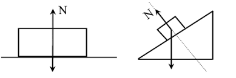{width=60%}
    :::
    
2.  *Fuerza de fricción o rozamiento* $\vec f_r$: Además de la fuerza normal, una superficie puede ejercer una fuerza de fricción sobre un objeto que es paralela a la superficie y de sentido contrario al desplazamiento del objeto.

    ::: {style="text-align:center;"}
    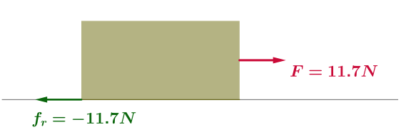{width=50%}
    :::
    
3.  *Fuerza de tensión* $\vec{T}$: Es la fuerza ejercida por una cuerda, cable, cadena, etc. Por ejemplo:

    ::: {style="text-align:center;"}
    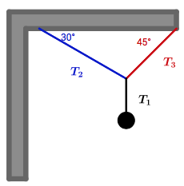{width=30%}
    :::

4.  *Fuerza Peso* $\vec{P}$: Es la
    fuerza que ejerce la gravedad sobre un objeto. Se trata de una
    fuerza de largo alcance, no es una fuerza de contacto. Siempre está
    dirigido hacia el suelo.

    ::: {style="text-align:center;"}
    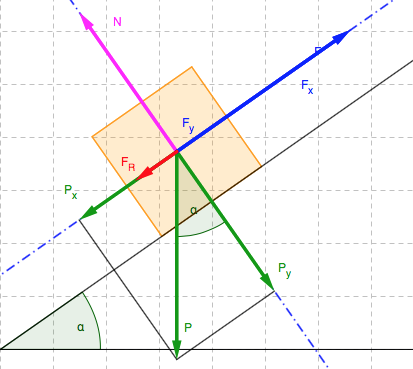{width=30%}
    :::

Algunas magnitudes de fuerzas comunes son las siguientes:

- Fuerza gravitacional del sol sobre la Tierra $\rightarrow 3.5 \times 10^{22}\text{ N}$.

- Peso de una manzana $\rightarrow 1\text{ N}$.

- Peso de un átomo de hidrógeno $\rightarrow1.6\times 10^{-26}\text{ N}$.

Un instrumento común para medir fuerzas es el *dinamómetro*.

## 1.3. Suma de fuerzas

Si dos fuerzas $\vec F_1$ y $\vec F_2$ actúan al mismo tiempo sobre un punto $O$ de un cuerpo, el efecto sobre el movimiento del cuerpo es igual al de una sola fuerza $\vec{R}$, que es igual a la suma vectorial de las fuerzas originales, $\vec{R}= \vec F_1 + \vec F_2$. En general, el efecto de cualquier número de fuerzas aplicadas a un punto de un cuerpo es el mismo que el que resultaría cuando una sola fuerza actuara sobre dicho punto, igual a la suma vectorial de todas ellas $\rightarrow$ *principio de superposición*.

:::{style="text-align:center;"}
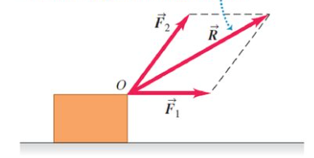{width="35%"}
:::

Este principio nos permite entonces sustituir un conjunto de fuerzas que
actúan sobre un objeto ejercidas todas ellas en un mismo punto, por su
vector fuerza resultante $\vec{R}$, y sus
componentes respectivas en el espacio

$$\vec R = \vec F_1+\vec F_2+\vec F_3+\dots+\vec F_n=\sum_{i=1}^n\vec F_i$$
$$\vec R = R_x \hat i + R_y \hat j + R_z \hat k\ \Rightarrow\ \left\lbrace\begin{array}{l} R_x=\sum_{i=1}^n {(F_i)}_x \ R_y = \sum_{i=1}^n {(F_i)}_y \ R_z = \sum_{i=1}^n {(F_i)}_z \end{array}\right.$$

:::: {.callout-note title="Ejemplo:" collapse="false" icon="false"}
Calcula la fuerza resultante, teniendo en cuenta los valores de los módulos y los ángulos que forman con el eje $x$ para las tres fuerzas $\vec{F_1}$, $\vec{F_2}$ y $\vec{F_3}$ de @fig-ejemplo1.

:::{style="text-align:center;"}
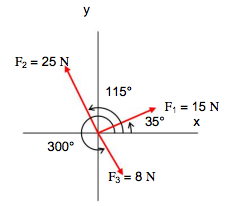{width=30% #fig-ejemplo1}
:::
:::{.callout-note title="Solución:" collapse="true" icon="false"}

Calculamos las componentes de cada una de las fuerzas:
$${F_1}_x = 15\cos 35^{\circ} = 12.29 \text{ N},\ {F_1}_y = 15\sin 35^{\circ} = 8.59 \text{ N}$$
$${F_2}_x = 25\cos 115^{\circ} = -10.59 \text{ N},\ {F_2}_y = 25\sin 115^{\circ} = 22.63 \text{ N}$$
$${F_3}_x = 8\cos 300^{\circ} = 4 \text{ N},\ {F_3}_y = 8\sin 300^{\circ} = -6.93 \text{ N}$$

Las componentes de la fuerza resultante son:
$$R_x = 12.29 - 10.59 + 4 = 5.7 \text{ N},\ R_y = 8.59 + 22.63 - 6.93 = 24.29 \text{ N}$$
El módulo de la fuerza resultante es:
$$|\vec{R}| = \sqrt{R_x^2 + R_y^2} = 25 \text{ N}$$
Y el ángulo que forma con el eje $x$ es:
$$\theta_R = \arctan\left(\frac{R_y}{R_x}\right) = 76.8^{\circ}$$
:::
::::


## 1.4. Primera Ley de Newton: Ley de la Inercia {#Primera-Ley-de-Newton:-Ley-de-la-Inercia}

Era sabido, ya desde tiempos de Galileo, que si se eliminan todas las fuerzas que actúan sobre un cuerpo, su velocidad no cambiará, propiedad de la materia que se describía como *inercia*. Esta conclusión fue establecida por Newton como su primera ley, también llamada *ley de la inercia*.

> PRIMERA LEY: *Todo cuerpo en reposo sigue en reposo a menos que sobre él actúe una fuerza externa. Un cuerpo en movimiento continúa moviéndose con velocidad constante a menos que sobre él actúe una fuerza externa.*

Como conclusión, un cuerpo sobre el que no actúa una fuerza neta se mueve con velocidad constante (que puede ser cero) y aceleración nula. Es decir, esta 1ª ley no distingue entre un objeto en reposo y otro que se mueve con velocidad constante, distinta de cero. El hecho de que un objeto esté en reposo o en movimiento con velocidad constante depende del sistema de referencia en el cual se observa el objeto. Hay que tener cuidado, porque la primera ley de Newton solo puede aplicarse a [sistemas de referencia denominados inerciales]{.underline}. De hecho, la 1ª ley de Newton nos proporciona un criterio para determinar si un sistema de referencia es inercial o no:

> *Si sobre un objeto no actúa ninguna fuerza, cualquier sistema de referencia con respecto al cual la aceleración del objeto sea cero, es un sistema de referencia inercial.*

Normalmente se considera que la Tierra es un sistema de referencia inercial (SRI), despreciando la aceleración debida al movimiento de la Tierra alrededor del Sol y de su propio movimiento de rotación.

## 1.5. Fuerza y masa {#Fuerza-y-masa}

Utilizando la 1º ley de Newton y la idea de SRI, podemos definir una **Fuerza** como una influencia externa sobre un objeto, que produce un cambio en su velocidad, es decir, una aceleración respecto a un sistema de referencia incercial. La **Fuerza** es una cantidad vectorial. Tiene módulo, dirección y sentido. Las fuerzas son ejercidas por unos cuerpos sobre otros. Las que se generan al estar dos cuerpos en contacto físico se llaman *fuerzas de contacto*, como por ejemplo golpear una pelota, tirar de un hilo, la fuerza de rozamiento entre un objeto y el suelo \dots, es decir, siempre debe haber un contacto directo entre el cuerpo que aplica la fuerza y el cuerpo sobre el cual se aplica. También hay fuerzas que no requieren contacto directo; éstas son las *fuerzas a
distancia*. Las fuerzas fundamentales son cuatro:

1.  *Interacción gravitacional*: Es la interacción entre partículas debida a su masa.

2.  *Interacción electromagnética*: Es la interacción de largo alcance entre partículas cargadas eléctricamente.

3.  *Interacción débil*: Es la interacción a corto alcance entre partículas subnucleares.

4.  *Fuerza nuclear fuerte*: Interacción de largo alcance entre los hadrones (protones y neutrones), que los mantiene unidos, formando el núcleo.

Por otra parte, sabemos que los objetos se resisten intrínsecamente a ser acelerados. Por ejemplo, si pensamos en dar una patada a un balón de fútbol o a una bola de una bolera, el sentido común nos dice que la segunda se resistirá más a ser acelerada. Esta propiedad intrínseca de un cuerpo es la **masa**. La masa es una medida de la
inercia de un cuerpo. Desde el 20 de mayo de 2019, la definición del kilogramo pasó a estar ligada con la constante de Planck, definida como $6.62607015\times 10^{-34}\text{ kg\, m}^2\text{ s}^{-1}$. El *Grand Kilo*, como se conoce al patrón parisino usado hasta la fecha para definir el kilogramo, es ahora un estándar de masa secundario, quedando el kilogramo ahora definido a partir de la constante de Planck y de otras unidades básicas del SI, como el segundo y el metro.

## 1.6. Segunda ley de Newton {#Segunda-ley-de-Newton}

> *La aceleración de un cuerpo es proporcional a la fuerza neta que  actúa sobre él, e inversamente proporcional a su masa.*

$$\vec{a} = \frac{\vec F_\text{neta}}{m};\ \vec{F}_\text{neta}=\sum_i\vec F_i$$

O lo que es lo mismo:

> *Si una fuerza externa neta actúa sobre un cuerpo, ésta se acelera, siendo la dirección de aceleración la misma que la de la fuerza neta. El vector de fuerza neta es igual a la masa del cuerpo multiplicada por su aceleración.*

Por ejemplo, una fuerza neta de 1 N le produce una aceleración de $1\text{ m/s}^2$ a un cuerpo de $1\text{ kg}$ de masa. Una fuerza neta de $2\text{ N}$ le producirá a un cuerpo de $2\text{ kg}$ de masa una aceleración también de $1\text{ m/s}^2$. Por tanto, si aplicamos la misma fuerza a dos objetos con diferente masa, el que tenga menos masa
se acelerará más.

$$\text{Fuerza neta} \Longrightarrow \text{produce aceleración} \ \text{Causa} \Longrightarrow \text{efecto}$$

::::{.callout-note title="Ejemplo:" collapse="false" icon="false"}
Un objeto, de masa $m_1=1\text{ kg}$, está sometido a una fuerza de módulo $|F_1|$, dirigida horizontalmente y en sentido positivo, adquiriendo una aceleración de módulo $|a_1|=5\text{ m/s}^2$. Posteriormente, se le aplica esta misma fuerza a otro objeto de masa $m_2$, adquiriendo una aceleración $|a_2|=11\text{ m/s}^2$. ¿Qué valor tiene la masa $m_2$?

:::{.callout-note title="Solución" collapse="true" icon="false"}
$$m_2 = \frac{m_1 \times |a_1|}{|a_2|}=0.45\text{ kg}$$

:::

::::

::::{.callout-note title="Ejemplo:" collapse="false" icon="false"}
Una partícula de masa $0.5$ kg está sometida simultáneamente a dos fuerzas, $\vec{F}_1= -2.0 \hat{\imath} - 3.0 \hat{\jmath}$ y $\vec{F}_2= -2.0 \hat{\imath} + 4.0 \, \hat{\jmath}$, ambas expresadas en N. Si la partícula está en el origen y parte del reposo para $t_0=0$, calcular:

1.  Su vector posición $\vec{r}$.

2.  Su velocidad $\vec{v}$, ambos para $t=2.0$ s.

:::{.callout-note title="Solución" collapse="true" icon="false"}

$$\vec{F}_\text{neta} = \vec{F}_1 + \vec{F}_2 = \left( -4.0 \hat{\imath} + 1.0 \hat{\jmath} \right)\text{ N}$$

Por componentes:

$$F_x = m a_x \Longrightarrow a_x= -8 \text{ m/s}^2, \ F_y = m a_y \Longrightarrow a_y= +2 \text{m/s}^2$$ 

$$x(t)= x(t_0) + v_x(t_0) (t-t_0) + \frac{1}{2}a_x(t - t_0)^2= -16.0\text{ m}$$
$$y(t)= y(t_0) + v_y(t_0) (t-t_0) + \frac{1}{2}a_y(t - t_0)^2= + 4.0\text{ m}$$ 
$$\fbox{$\vec{r} =\left( -16.0 \hat{\imath} + 4.0 \, \hat{\jmath} \right)\text{ m}$}$$
$$v_x(t) = v_x(t_0) + a_x(t-t_0) = -16.0 \text{ m/s}$$
$$v_y(t) =v_y(t_0) + a_y (t-t_0) = + 8.0 \text{ m/s}$$
$$\fbox{$\vec{v} = \left ( -16.0 \hat{\imath} + 8.0 \hat{\jmath} \right ) \text{ m}$}$$

:::

::::

## 1.7. Fuerza debida a la gravedad: El peso {#fuerza-debida-a-la-gravedad-el-peso}

Si dejamos caer un objeto cerca de la superficie de la Tierra, el objeto acelera en dirección hacia la Tierra. Despreciando la resistencia del aire, todos los objetos poseen la misma aceleración, $\vec{g}$. La fuerza que causa esta aceleración es la Fuerza de la gravedad, $\vec{F}_g$, que ejerce la Tierra sobre cualquier objeto con una determinada masa $m$. Si solo actúa esa fuerza sobre el objeto, se dice que el cuerpo está en caída libre:

$$\vec{F}_g = m \vec{g} \ \Rightarrow\ \vec{g} = -9.81\hat\jmath \text{ m/s}^2$$

siempre que estemos cerca de la superficie de la Tierra. En general, $g$ será menor para cuerpos situados más
lejos de la superficie de la Tierra, y también será menor en latitudes diferentes al ecuador.

El peso no es una propiedad intrínseca de los cuerpos, lo que sí es una propiedad intrínseca es la masa. Por ejemplo, el peso de un objeto en la Luna será aproximadamente $1/6$ de su peso en la Tierra.

El **peso aparente** es la fuerza que equilibra el peso (por ejemplo, en una balanza, será la fuerza normal que ésta ejerce sobre el cuerpo). Si el peso aparente es cero (no hay ninguna fuerza que equilibra el peso del cuerpo), diremos que el cuerpo está en **caída libre** $\rightarrow$ **ingravidez**.

## 1.8. Fuerzas de contacto: sólidos, muelles y cuerdas

La **fuerza normal** es la fuerza que cualquier superficie ejerce sobre un objeto, y que siempre es perpendicular a la misma, como se puede ver en la siguiente figura:

:::{style="text-align:center;"}
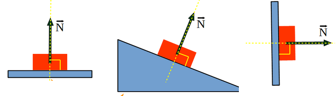{width=60%}
:::

La fuerza que ejerce un muelle sobre un objeto viene dada por la **ley de Hooke**. Suponiendo que el muelle esté situado en la dirección del eje $x$, la fuerza que ejerce el muelle sobre el objeto se expresa de la siguiente forma:

$$\vec{F} = -k \, \Delta x \, \hat{\imath}$$

donde $k$ es la constante elástica del muelle, y mide la rigidez del mismo. $\Delta x$ es el desplazamiento realizado por el muelle, respecto de su posición de equilibrio $x_0$.

La figura siguiente muestra cómo es la fuerza elástica del muelle sobre un objeto, suponiendo que la posición de equilibrio es $x_0=0$.

:::{style="text-align:center;"}
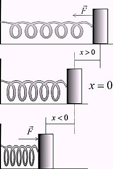{width=30%}
:::

Un objeto en reposo bajo la acción de fuerzas que se equilibran se dice que está en *equilibrio estático*. Si un pequeño desplazamiento da lugar a una fuerza de restitución neta hacia la posición de equilibrio, se dice que el equilibrio es *estable*.

::::{.callout-note title="Ejemplo:" collapse="false" icon="false"}
Una jugadora de baloncesto de $95\text{ kg}$ se cuelga del aro del cesto después de haber hecho un mate. Antes de dejarse caer, se queda en reposo, con el anillo del aro doblado hacia abajo 10 cm. Si suponemos que el aro se comporta como un muelle elástico, calcular $k$.

:::{.callout-note title="Solución" collapse="true" icon="false"}

Teniendo en cuenta que la fuerza realizada por el muelle equilibra el peso de la jugadora, tendremos que:

$$mg=k\Delta y \ \rightarrow \ k = \frac{mg}{\Delta y}=\frac{95\text{ kg} \times 9.8 \text{ m/s}^2} {10 \times 10^{-2} \text{ m} } = 7.2 \times 10^3 \text{ N/m}$$

:::
::::

::::{.callout-note title="Ejemplo:" collapse="false" icon="false"}
Un racimo de bananas de $2\text{ kg}$ está suspendido en reposo de una balanza de muelle, cuya constante es $k=200\text{ N/m}$. Calcular cuál ha sido el estiramiento del muelle respecto de su posición de equilibrio.

:::{.callout-note title="Solución" collapse="true" icon="false"}

$$mg = k \Delta y \ \rightarrow \ \Delta y = \frac{2\text{ kg} \times 9.8 \text{ m/s}^2}{200\text{ N/m}}$$

:::
::::

La magnitud de la fuerza que un trozo de cuerda ejerce sobre otro adyacente se denomina $tensión$.

::::{.callout-note title="Ejemplo:" collapse="false" icon="false"}
Una pelota $C$ que pesa $P=6\text{ N}$ se cuelga mediante dos cables ($A$ y $B$) que ejercen tensiones $T_A$ y $T_B$, respectivamente, tal como indica la @fig-e6. Determinar ambas tensiones, suponiendo que la pelota se encuentra en equilibrio estático.

:::{style="text-align:center;"}
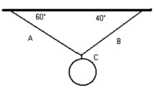{width=25% #fig-e6}
:::

:::{.callout-note title="Solución:" collapse="true" icon="false"}
$${T_A}_x = T_A \cos (60^{\circ}), \ \ {T_A}_y=T_A \sin (60^{\circ}) $$
$${T_B}_x=T_B \, \cos (40^{\circ}), \ \ {T_B}_y=T_B \, \sin (40^{\circ} )$$

Teniendo en cuenta que el sistema está en equilibrio

$${T_A}_x = {T_B}_x \ \rightarrow \ T_A \cos (60^{\circ}) = T_B \cos (40^{\circ}) \ \rightarrow \ T_B = T_A \frac{\cos ( 60^{\circ})} {\cos ( 40^{\circ})}$$
$$ {T_A}_y + {T_B}_y = P\ \rightarrow \ T_A \sin (60^{\circ}) + T_A \cos ( 60^{\circ}) \, \tan( 40^{\circ}) =P$$

Por tanto:

$$T_A = \frac{P}{\sin (60^{\circ}) + \cos (60^{\circ}) \tan( 40^{\circ})} = 4.667\text{ N}$$
$$T_B= T_A \frac{\cos (60^{\circ})} {\cos ( 40^{\circ})} = 3.046 \text{ N}$$
:::
::::

Esto nos servirá para explicar con más detalle los diagramas de cuerpo libre para la **resolución de problemas**:

- **Planteamiento:** Identificar todas las fuerzas que actúan sobre la partícula, así como la dirección del vector $\vec{a}$. Esto será útil para elegir el sistema de referencia más adecuado.

- **Solución:**

  1.  Dibujar un diagrama claro.

  2.  Aislar al cuerpo de interés e identificar y representar cada una de las fuerzas que actúan sobre él.

  3.  Elegir un sistema de coordenadas adecuado. Si se conoce la dirección de $\vec{a}$, escoger uno de los ejes paralelo a ella. Para cuerpos que se deslizan sobre superficies, elegir los ejes de forma que uno sea paralelo y el otro perpendicular a la superficie.

  4.  Aplicar la segunda ley de Newton en forma de componentes.

- **Comprobación:** Ver si los resultados tienen las unidades correctas y parecen razonables los valores obtenidos.

::::{.callout-note title="Ejemplo:" collapse="false" icon="false"}
Una joven tira de un trineo con una fuerza de $100\text{ N}$, formando un ángulo de $30^{\circ}$ con la horizontal. La masa del conjunto trineo-cuerda-pasajero es de $75\text{ kg}$ y suponemos que podemos despreciar el rozamiento. Determinar la aceleración $\vec{a}$ que adquiere el sistema y la fuerza normal $\vec{N}=F_N \hat{\jmath}$ ejercida por la superficie sobre el trineo.

:::{style="text-align:center;"}
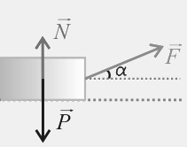{width=25%}
:::

::: {.callout-note title="Solución:" collapse="true" icon="false"}

$$F_x= m a_x \ \rightarrow \ a_x = \frac{F \cos(30^{\circ})}{m} = 1.15 \text{  m/s}^2$$
$$F_N + F \sin (30^{\circ}) = m g \ \rightarrow \ F_N = 685 \, \text{  N}$$
:::
::::

::::{.callout-note title="Ejemplo:" collapse="false" icon="false"}
Dejamos caer un paquete desde la parte superior de un plano inclinado. Sabemos que si la velocidad vertical con la que el paquete llega al final de la rampa es superior a $1.5\text{ m/s}$, la carga del paquete se daña. Calcular el máximo ángulo que puede tener el plano inclinado para que podamos tener una recepción segura de la carga, teniendo en cuenta que la altura del plano inclinado es $h=1.5\text{ m}$.

:::{style="text-align:center;"}
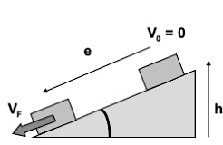{width=30%}
:::

:::{.callout-note title="Solución:" collapse="true" icon="false"}

Supondremos que el eje $x$ es el paralelo al plano y el eje $y$ el perpendicular. La velocidad vertical será la que tiene el objeto en la dirección vertical, cuando llega al suelo.

$$P_x = m a_x, \ F_N - P_y = 0, \ a_x = \frac{m g \sin\theta }{m}, \ \sin \theta = \frac{h}{e}$$ 
$$ v_x^2(t) =v_x^2(t=0) + 2 a_x e \ v_x^2(t) = 2 g\sin\theta \frac{h}{\sin \theta}, \ \sin^2 \theta = \frac{v_v^2}{v_x^2(t)}=\frac{v_v^2}{2 g h}$$

Por tanto:

$$\sin \theta = \sqrt{ \frac{v_v^2}{2 g h}} =0.2766 \ \rightarrow \ \theta = 16.06^{\circ}$$
:::
::::


## 1.9. Tercera ley de Newton {#Tercera-ley-de-Newton}

Si se aplica una fuerza sobre un cuerpo $A$, debe haber un cuerpo $B$ que ejerza la fuerza. La 3ª ley de Newton establece entonces que dichos cuerpos ejercen fuerzas entre sí que tienen el mismo módulo, la misma dirección y sentidos contrarios.

> *$A$ ejerce una fuerza sobre $B$ $\Longrightarrow$ $B$ ejerce una fuerza sobre $A$, de igual módulo, dirección y sentido opuesto.*

En general, podemos enunciar la tercera ley de Newton de la siguiente manera:

> *Las fuerzas siempre actúan por pares, iguales y opuestas. Si el cuerpo $A$ ejerce una fuerza  $\vec{F}_{AB}$ sobre el cuerpo $B$, éste ejerce una fuerza igual, pero opuesta, $\vec{F}_{BA}$ sobre el cuerpo $A$, de tal manera que: $$\vec{F}_{BA} = -\vec{F}_{AB}$$*

Es común referirse a estas fuerzas como par acción-reacción. Ambas fuerzas actúan siempre *simultáneamente y sobre objetos diferentes*. En la figura siguiente se muestra esta propiedad, en el caso de dos masas $A$ y $B$.

::: {style="text-align:center;"}
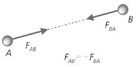{width=80%}
:::

## 1.10. Problemas con dos o más objetos {#Problemas-con-dos-o-más-objetos}

Como regla general, para aplicar las leyes de Newton a dos o más cuerpos, deberemos:

1.  Dibujar un diagrama de fuerzas para cada cuerpo. Las incógnitas se obtendrán al resolver simultáneamente las ecuaciones.

2.  Usar un sistema de coordenadas distinto para cada cuerpo y tener en cuenta en el principio de acción-reacción.

3.  Aplicar la 2ª ley de Newton a cada objeto.

4.  Resolver las ecuaciones obtenidas.

::::{.callout-note title="Ejemplo:" collapse="false" icon="false"}
Dos alpinistas unidos por una cuerda, quedan en la posición que se describe en la figura. Determinar la aceleración que adquiriría el conjunto formado por ambos.

::: {style="text-align:center;"}
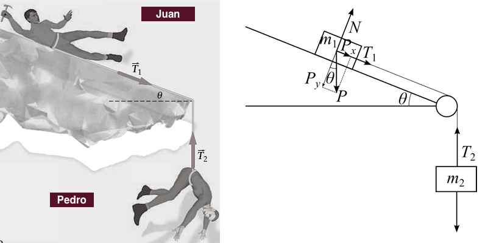{width=50%}
:::

:::{.callout-note title="Solución:" collapse="true" icon="false"}

Teniendo en cuenta que Juan tiene masa $m_1$ y Pedro, $m_2$, tendremos que:

$$\sum_i (\vec{F_1})_i = m_1 \vec{a}_1, \ \sum_i(\vec{F_2})_i = m_2 \, \vec{a}_2$$

Si suponemos que la masa de la cuerda es despreciable, las tensiones serán iguales $\rightarrow\ T_1=T_2=T$. Por tanto, para cada objeto, en la dirección del movimiento, tendremos las siguientes ecuaciones 

$$T + P_{1x} = m_1 a \ \rightarrow \ T + m_1 g \sin \theta = m_1 a ;\ P_2 - T = m_2 a$$

Sumando ambas ecuaciones:
$$P_2 + m_1 g \sin \theta = (m_1 + m_2 ) a \ \rightarrow \ a = g \frac{\left ( m_2 + m_1 \sin \theta \right )}{m_1 + m_2}$$
:::
::::

# 2. Equilibrio

## 2.1.  Momento de una fuerza

Los cuerpos no siempre pueden ser considerados como masas puntuales. Los cuerpos son extensos, y las fuerzas aplicadas sobre ellos no tienen por
qué tener un punto de aplicación común. En ese caso hay que considerar el punto de aplicación de cada fuerza que actúe sobre el cuerpo.


::: columns

::: {.column width="75%"}
Cuando el cuerpo se mueve lo puede hacer de dos formas posibles: se traslada o gira. En la mayoría de los casos, se traslada y gira a la vez. Si se aplica una fuerza sobre un cuerpo de manera que este pueda girar, para describir este efecto se utiliza una magnitud llamada momento de la fuerza (o torque de la fuerza).
:::

::: {.column width="25%"}
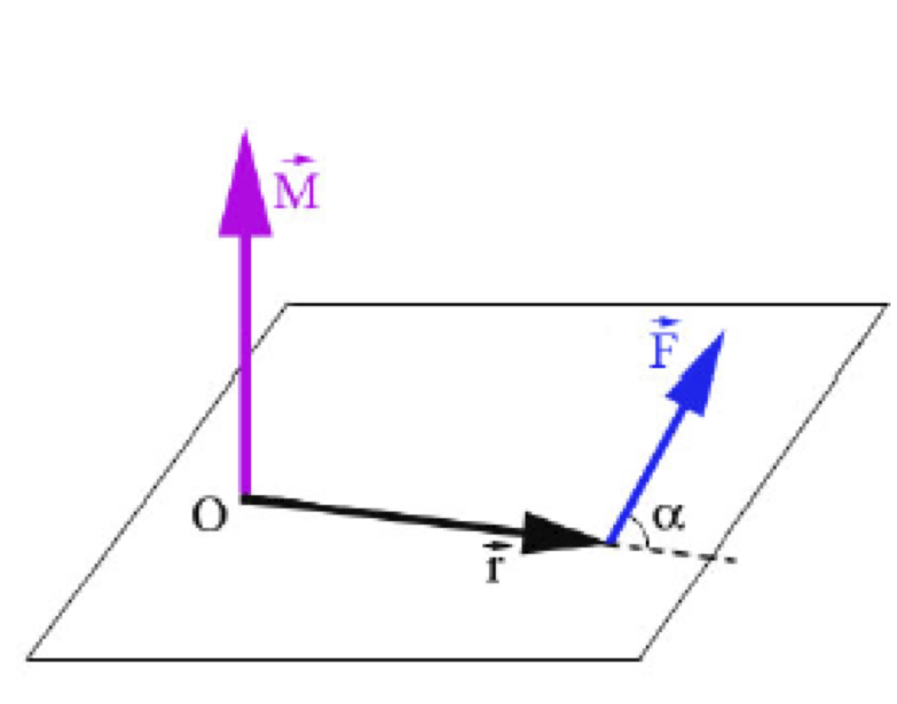{width=100%}
:::

:::


El momento $\vec M$ de una fuerza $\vec F$ respecto de un punto $O$ es un vector de módulo $M=r F \sin \alpha$, siendo $\alpha$ el ángulo que forman los vectores $\vec r$y $\vec F$, o dicho de otra forma:

$$\vec M_O = \vec r \times \vec F$$

La dirección del vector $\vec M_0$ es perpendicular al plano que forman los vectores $\vec r$ y $\vec F$, y su sentido viene dado por la regla del tornillo o mano derecha (sentido del giro desde $\vec r$ hasta $\vec F$ por el camino más corto). La unidad del momento de una fuerza en el SI es $\text{N}\,\text{m}$.

Por tanto, el momento de la fuerza depende de la distancia al punto de aplicación, y es mayor cuanto mayor sea dicha distancia. Por esta razón, para hacer girar un tuerca interesa utilizar una llave inglesa cuyo mango sea lo más largo posible, porque el efecto de giro será mayor al aumentar el momento de la fuerza. Ahora ya sabes por qué las manivelas de las puertas se colocan en el lado opuesto a las bisagras. Si intentas abrir una puerta empujando cerca de las bisagras verás que te resulta casi imposible.

:::: {.callout-note title="Ejemplo:" collapse="false" icon="false"}
Un volante de $30 \text{ cm}$ de radio puede girar alrededor de su eje. Si aplicas una fuerza tangencial de $15 \text{ N}$ en la periferia, ¿cuál es el momento de dicha fuerza respecto del centro del volante?

:::{.callout-note title="Solución:" collapse="true" icon="false"}
$$M = r F \sin \alpha = 0.3 \text{ m} \times 15 \text{ N} \times \sin 90^{\circ} = 4.5 \text{ N}\,\text{m}$$
:::

::::

Si sobre un cuerpo actúan simultáneamente varias fuerzas, el momento resultante del sistema es igual a la suma de los momentos de cada una de las fuerzas respecto del mismo punto:

$$\vec {M_\text{Total}}_O = \sum_i {\vec M_i}_O=\vec {M_1}_O + \vec {M_2}_O + \cdots$$

## 2.2.  **El equilibrio de los cuerpos y el sólido rígido**

Un sólido rígido es un cuerpo que no cambia de forma ni de volumen aunque se le apliquen fuerzas. Esto significa que las distancias entre sus partículas permanecen constantes. Es decir, aunque el sólido rígido pueda moverse o girar, su forma se mantiene inalterada.

Decimos que un sólido rígido está en equilibrio estático cuando no tiene movimiento de traslación ni de rotación. Para que un cuerpo esté en equilibrio estático debe cumplir dos condiciones: que no se traslade y que no rote.

La primera condición de equilibrio estático establece que no haya movimiento de traslación, por lo que la resultante de las fuerzas que actúan sobre el cuerpo tiene que ser igual a cero:

$$\vec {F_\text{Total}} = \sum_i \vec F_i = 0\text{ (condición de equilibrio traslacional)}$$

La segunda condición de equilibrio estático establece que no haya movimiento de rotación, por lo que la resultante de los momentos de las
fuerzas externas aplicadas al cuerpo respecto de un punto tiene que ser igual a cero:

$$\vec {M_\text{Total}}_O = \sum_i {\vec M_i}_O=\vec {M_1}_O + \vec {M_2}_O + \cdots = 0\text{ (condición de equilibrio rotacional)}$$

## 2.3.  **El centro de gravedad**

El centro de gravedad es un punto en el que puede considerarse aplicada la fuerza de la gravedad que actúa sobre él. Dicho de otro modo, es el punto en el que se puede imaginar concentrado todo su peso.

Es un punto importante porque describe cómo se comporta un cuerpo bajo la acción de la gravedad, de forma que si el cuerpo se apoya o se suspende por su centro de gravedad, permanecerá en equilibrio; si no, tenderá a girar o a caer hasta que dicho punto quede lo más bajo posible. Por ejemplo, en un sólido rígido como una regla, el centro de gravedad se encuentra en el punto medio de la regla; en un martillo, en cambio, está más cerca de la parte metálica, que es la más pesada.

Si tratamos de separar un cuerpo de su posición de equilibrio, pueden suceder tres cosas:

1.  Que el cuerpo vuelva a la posición inicial (equilibrio estable).

2.  Que el cuerpo vuelque (equilibrio inestable) 

3.  Que permanezca en la nueva posición (equilibrio indiferente).

Si un cuerpo está apoyado sobre una superficie horizontal se encontrará en equilibrio si cumple las condiciones anteriores de equilibrio traslacional y rotacional. Cuanto más cercano a la superficie horizontal (más bajo) esté el centro de gravedad y más grande sea la base de apoyo del cuerpo, más estable será el equilibrio.

En el cuerpo humano, el centro de gravedad cambia su ubicación según la posición del cuerpo. De pie, está aproximadamente en la barriga o la cintura baja. Al levantar los brazos, o al inclinarnos, el centro de gravedad se desplaza.

:::::{.callout-note title="Ejemplo:" collapse="false" icon="false"}
Calcula las fuerzas que deben soportar cada una de las patas de la mesa de la figura, si su peso es de 150 N y colocamos un cuerpo de 50 N en el punto indicado en la @fig-e7.

:::{style="text-align:center;"}
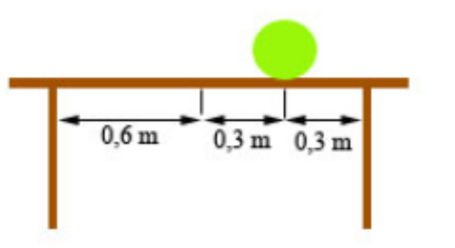{width="2.4875in" height="1.35in" #fig-e7}
:::

::::{.callout-note title="Solución:" collapse="true" icon="false"}

:::{style="text-align:center;"}
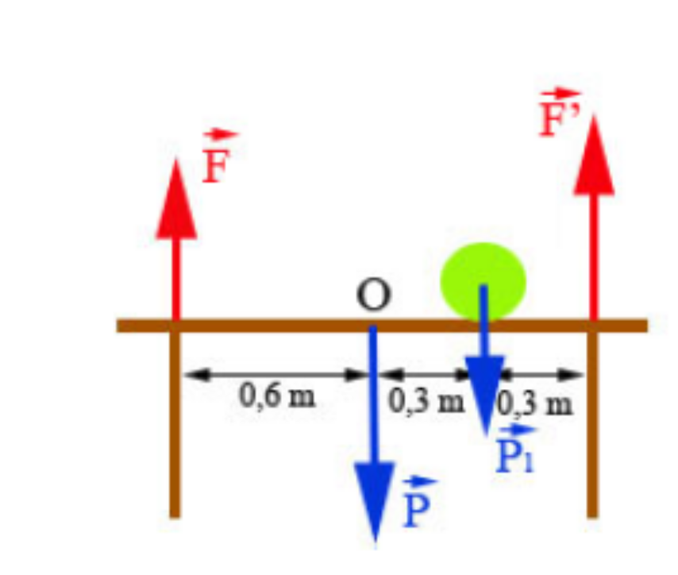{width="2.81875in" height="2.397222222222222in"}
:::
El tablero de la mesa debe estar en equilibrio. Suponemos que la mesa tiene dos patas.

La primera condición para equilibrio traslacional $\rightarrow$ la fuerza total que actúa sobre el tablero es cero:

$$
F+F'-P-P_1=0 \ \rightarrow \ F+F' = 200\text{ N}
$$ {#eq-i}

De la segunda condición para que haya equilibrio rotacional $\rightarrow$ la suma de los momentos respecto de un punto es cero:

$$
F'\cdot0.6-P_1\cdot0.3-F\cdot0.6=0 \ \rightarrow \ 0.6F'-0.6F = 15\text{ N}
$$ {#eq-ii}

Las ecuaciones [-@eq-i] y [-@eq-ii] forman un sistema de dos ecuaciones con dos incógnitas. Resolviendo el sistema:

$$F=92.5\text{ N}, \ F'=107.5\text{ N}$$

::::
:::::

### 2.3.1  Test de repaso:
###  Test de repaso:

```quizdown

## Pregunta 1
El tirador de una puerta se coloca en el centro de la puerta en lugar de en un lado, ¿qué sucede con el valor de la fuerza necesaria para abrir la puerta?

- [ ] No varía.
- [x] Se duplica.
- [ ] Se reduce a la mitad.
- [ ] Se cuadruplica.

## Pregunta 2
Un niño de 35 kg de masa se coloca a 1.5 m del punto de apoyo de un balancín. ¿Dónde se debe colocar una chica de 25 kg de masa para equilibrar el balancín? Suponga que el balancín está formado por una barra uniforme apoyada en su centro.

- [ ] 1.0 m.
- [x] 2.1 m.
- [ ] 3.0 m.
- [ ] No se puede calcular, faltan datos.
```

# 3.  Cantidad de movimiento o momento lineal

Seguramente habrás observado que es mas difícil detener un coche cuanta más velocidad lleve, o que si tenemos un camión y un coche que se mueven a la misma velocidad, es más difícil detener el camión. Newton llamó cantidad de movimiento de un cuerpo a la magnitud que caracteriza su estado de movimiento.

La cantidad de movimiento de una partícula, o momento lineal $\vec p$, es una magnitud vectorial que se define como el producto de la masa de la partícula por su velocidad:

$$\vec p = m \vec v$$

Esta magnitud vectorial permite cuantificar la intensidad del movimiento de un cuerpo, es decir, da idea del grado de dificultad que presenta para ser modificado. Cuanto mayor sea su valor, mayor será el esfuerzo necesario para cambiar dicho movimiento.

Las unidades de la cantidad de movimiento en el SI son $\text{kg\, m\, s}^{-1}$.

Para un cuerpo formado por $N$ partículas, la cantidad de movimiento total es igual a la suma de las cantidades de movimiento de cada una de ellas:

$$\vec p_\text{total} = \sum_{i=1}^N \vec p_i=\vec p_1 + \vec p_2 + \cdots + \vec p_N$$

Un cuerpo puede tener una gran cantidad de movimiento si tiene una masa grande o si se mueve a gran velocidad.

::::{.callout-note title="Ejemplo:" collapse="false" icon="false"}
La cantidad de movimiento de un camión de 12 toneladas que se mueve con una velocidad de $\text{15 km/h}$ es la misma que la de un coche de 900 kg. ¿Con qué velocidad debería moverse el coche para que la afirmación anterior fuera cierta?

:::{.callout-note title="Solución:" collapse="true" icon="false"}
$$p=mv\ \Rightarrow m_\text{coche}v_\text{coche}=m_\text{camión}v_\text{camión}\ \Rightarrow v_\text{coche}=\frac{m_\text{camión}v_\text{camión}}{m_\text{coche}}=\frac{12000 \times 15}{900}=200\text{ km/h}$$
:::

::::

## 3.1.  Relación entre cantidad de movimiento y fuerzas aplicadas

Supongamos que un cuerpo con masa m sufre un cambio en su velocidad. Su cantidad de movimiento o momento lineal también experimentará un cambio, dado por:

$$\Delta \vec p = m \Delta \vec v$$

Calculando la variación de la cantidad de movimiento y dividiendo por el tiempo trascurrido tenemos:

$$\frac{\Delta \vec p}{\Delta t} = m \frac{\Delta \vec v}{\Delta t}$$

Pero $\frac{\Delta \vec v}{\Delta t} = \vec a$, por lo que $$\frac{\Delta \vec p}{\Delta t} = m \vec a=\sum \vec F$$ (la 2ª Ley de Newton). En resumen, tenemos $$\frac{\Delta \vec p}{\Delta t} = \sum \vec F$$ que es otra forma de escribir la 2ª Ley de Newton, y que nos dice:

>La variación de la cantidad de movimiento con el tiempo de un cuerpo es igual a la resultante de las fuerzas aplicadas sobre el cuerpo", o lo que es lo mismo "La cantidad de movimiento de un cuerpo cambia debido a la acción de fuerzas sobre él.

Si despejamos la variación de la cantidad de movimiento obtenemos:

$$\Delta \vec p = \sum \vec F \Delta t$$

El producto de la fuerza por el tiempo que ha estado actuando se denomina impulso mecánico $\vec I$:

$$\vec I = \sum \vec F \Delta t$$

El impulso se mide en $\text{N\,s}$ (que es equivalente a la unidad de cantidad de movimiento $\text{kg\,m\,s}^{-1}$), y es igual al cambio total que se ha producido en la cantidad de movimiento:

$$\vec I = \Delta \vec p$$

El impulso mecánico tiene una gran importancia en aplicaciones de la vida diaria. Por ejemplo, en el salto con pértiga o en el salto de altura los saltadores caen sobre una colchoneta. Los coches disponen de sistemas como el airbag, el cinturón de seguridad o el parachoques, que tienen funciones parecidas. En todos estos casos se intenta que el impulso necesario para detener a la persona se realice en un tiempo mayor, con lo que la fuerza que deberá soportar su estructura corporal será menor y, por lo tanto, será más difícil lesionarse.

::::{.callout-note title="Ejemplo:" collapse="false" icon="false"}
Un palo de golf impacta en una bola con una fuerza media de $2500\text{ N}$. Si el tiempo de contacto entre el palo y la bola es de dos milésimas de segundo, ¿cuál es el impulso que comunica a la bola?

:::{.callout-note title="Solución:" collapse="true" icon="false"}
$$2500 \times 0.002 = 5 \text{ Ns}$$
:::

::::

::::{.callout-note title="Ejemplo:" collapse="false" icon="false"}
Sobre un cuerpo de $75\text{ kg}$ actúa una fuerza de $55\text{ N}$ durante $14\text{ s}$.
Calcula:

a)  El impulso de la fuerza.

b)  La variación de la cantidad de movimiento del cuerpo.

c)  Su velocidad final si en el momento de actuar la fuerza el cuerpo se mueve a $9 \text{ m/s}$.

:::{.callout-note title="Solución:" collapse="true" icon="false"}

a)  $\vec I = \sum \vec F \Delta t = 55 \text{ N} \times 14 \text{ s} = 770 \text{ Ns}$$

b)  $\Delta \vec p = \vec I = 770 \text{ Ns}$$

c)  Como $\Delta \vec p = m \Delta \vec v$, tenemos que:

$$\Delta \vec v = \frac{\Delta \vec p}{m} = \frac{770}{75} = 10.27 \text{ m/s}$$

Por lo tanto, la velocidad final es:

$$v_f = v_i + \Delta v = 9 + 10.27 = 19.27 \text{ m/s}$$

:::

::::

## 3.2.  Conservación de la cantidad de movimiento

Acabamos de ver que la cantidad de movimiento cambiará cuando exista una resultante de fuerzas aplicada sobre la partícula
($\sum \vec F \neq \vec 0$). Por lo tanto, para que la cantidad de movimiento se conserve ($\vec p = \vec 0$), es necesario que
la resultante de todas las fuerzas que actúen sobre el cuerpo sea cero. A esto se le conoce como Principio de conservación de la cantidad de movimiento:

>La cantidad de movimiento de una particula permanece constante si y solo si la resultante de las fuerzas que actúan sobre la partícula es cero (es otra forma de expresar el primer principio de la dinámica o principio de inercia):

$$\text{Si } \sum \vec F = \vec 0 \Rightarrow \Delta \vec p = \vec 0\ \Rightarrow m\vec v=cte,\text{ y si } m=cte \text{ entonces } \vec p = \text{cte}$$

La conservación de la cantidad de movimiento se puede generalizar a un sistema de partículas. Un sistema de partículas es un conjunto de partículas del que queremos estudiar su movimiento.

Como ya se ha visto, la cantidad de movimiento o momento lineal de un sistema de partículas es la suma de las cantidades de movimiento de cada una de las partículas que lo forman. El principio de conservación de la cantidad de movimiento lineal para un sistema de partículas afirma que si la resultante de las fuerzas exteriores que actúan sobre un sistema de partículas es nula, la cantidad de movimiento del sistema permanece constante. Aunque la cantidad de movimiento del sistema permanezca constante, puede variar la cantidad de movimiento de cada partícula del sistema.

Este principio tiene bastante aplicación en los problemas de cuerpos que chocan, explosiones, etc.

Cuando se produce una colisión (choque en dos cuerpos) o una explosión (varios cuerpos estaban juntos y se separan), podemos usar la conservación de la cantidad de movimiento para estudiar el problema, teniendo en cuenta las siguientes consideraciones:

1.  Estudiamos los diferentes fragmentos como partes de un mismo cuerpo. De este modo al sumar las fuerzas que se ejercen mutuamente durante la interacción, la resultante es nula.

2.  Consideramos que la colisión o la explosión ocurre muy rápido, de manera que las fuerzas externas (gravedad, etc) apenas han
    modificado el movimiento del sistema durante la interacción.

De esta forma, es una muy buena aproximación el considerar que la cantidad de movimiento total es la misma justo antes y justo después de la interacción (choque o explosión):

$$\vec p_\text{total}^\text{antes} = \vec p_\text{total}^\text{después}$$

::::{.callout-note title="Ejemplo:" collapse="false" icon="false"}
Un niño, cuya masa es de $40\text{ kg}$, está encima de un monopatín, de $3\text{ kg}$ de masa. En un instante dado, el niño salta hacia delante con una velocidad de $1 \text{ m/s}$. Calcula la velocidad con la que se mueve el monopatín.

:::{.callout-note title="Solución" collapse="true" icon="false"}
Como la resultante de las fuerzas externas aplicadas al sistema niño+patín es cero, se conserva la cantidad de movimiento del
sistema:
$$\vec p_\text{total}^\text{antes} = \vec p_\text{total}^\text{después}$$
$$0 = m_\text{niño} v_\text{niño} + m_\text{patín} v_\text{patín}$$
$$v_\text{patín} = - \frac{m_\text{niño} v_\text{niño}}{m_\text{patín}} = - \frac{40 \text{ kg} \times 1 \text{ m/s}}{3 \text{ kg}} = -13.33 \text{ m/s}$$
:::
::::

```quizdown
# Pregunta 1
Una persona de $75\text{ kg}$ camina con una velocidad de $2\text{ m/s}$. ¿Cuál es su cantidad de movimiento?

- [x] $150\text{ kg m/s}$
- [ ] $37.5\text{ kg m/s}$
- [ ] $150\text{ N}$
- [ ] $150\text{ kg m/s}^2$

# Pregunta 2
¿Qué afirmación sobre la cantidad de movimiento o el impulse mecánico es correcta?

- [ ] El impulso y la cantidad de movimiento son magnitudes escaleres.
- [ ] La unidad de la cantidad de movimiento es $\text{kg m/s}^2$.
- [ ] El impulso es una fuerza.
- [x] La unidad de impulso es $\text{Ns}$.

# Pregunta 3
Un martillo de $1.5\text{ kg}$, que maneja un operario distraído, golpea la uña de su dedo cuando se mueve a $3.5\text{ m/s}$ y rebota con la misma velocidad. Si el tiempo que dura el golpe es de $0.075\text{ s}$, ¿cuál es el valor de la fuerza media que ejerce el martillo sobre la uña?

- [ ]  $70\text{ N}$
- [x]  $140\text{ N}$
- [ ]  $35\text{ N}$
- [ ]  $210\text{ N}$

# Pregunta 4
Dos bolas de billar, situadas sobre una mesa, impactan una con la otra. ¿Qué sucede con la cantidad de movimiento de las bolas?

- [ ] La cantidad de movimiento de las bolas es la misma.
- [x] La cantidad de movimiento del sistema formado por las dos bolas no varía.
- [ ] La cantidad de movimiento del sistema formado por las dos bolas aumenta.
- [ ] La cantidad de movimiento del sistema formado por las dos bolas disminuye.

# Pregunta 5
Dos patinadores, uno de $60\text{ kg}$ y el otro de masa desconocida, se encuentran juntos, en reposo, antes de empezar a patinar. Empiezan el movimiento empujándose uno a otro. El primero sale con una velocidad de $15\text{ km/h}$ y el segundo con una velocidad de $4\text{ m/s}$ en sentido contrario. ¿Cuál es la masa del segundo patinador?

- [ ] $60\text{ kg}$.
- [ ] $48\text{ kg}$.
- [x] $75\text{ kg}$
- [ ] $80\text{ kg}$
```