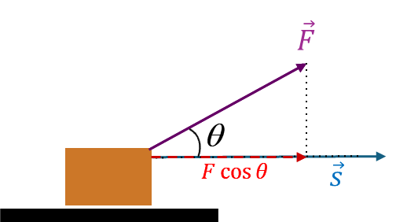
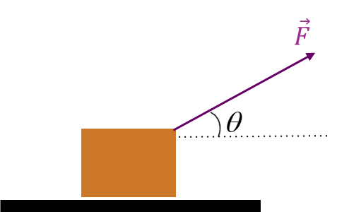
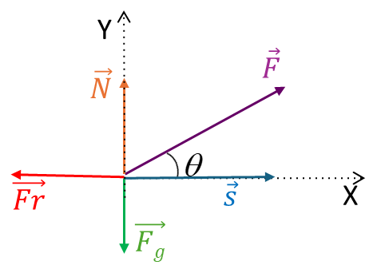
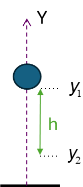
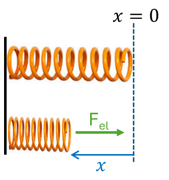

# 1.  Energía

El estudio del movimiento de una partícula se puede realizar en términos de las tres leyes de la dinámica de Newton, siendo la **fuerza** lamagnitud física que determina el movimiento. Sin embargo, a veces resulta más sencillo analizar dicho movimiento en términos de otra magnitud física que, bajo ciertas condiciones, se conserva entre el estado inicial y el final. Dicha magnitud es la **energía**, que se define como la capacidad de un sistema o cuerpo para producir transformaciones en otros cuerpos o sobre sí mismo. Podemos decir entonces que un cuerpo tiene energía.

La energía puede transmitirse entre los cuerpos mediante la realización de trabajo o mediante el intercambio de calor. Por lo tanto, trabajo y calor son formas de transferencia de energía, pero, a diferencia de la energía, no son propiedades de un cuerpo.

# 2.  Trabajo

En el lenguaje cotidiano suele relacionarse el realizar un esfuerzo con hacer un trabajo. Sin embargo, en Física, puede que la realización de esfuerzo lleve a un trabajo nulo.

Supongamos que sobre un cuerpo actúa una **fuerza constante** $\vec F$ provocando sobre él un desplazamiento $\vec s$ como se muestra en la @fig-fuerza-desplazamiento. 

::: {style="text-align:center;"}
{width=50% #fig-fuerza-desplazamiento} 
:::

El trabajo ($W$) realizado por la fuerza se calcula como el producto escalar de los vectores fuerza y desplazamiento:

$$
W = \vec F \cdot \vec s = F\, s\cos\theta
$$ {#eq-trabajo}

Siendo $\theta$ el ángulo formado por los dos vectores (ver @fig-fuerza-desplazamiento). Sólo la componente de la fuerza en la dirección del desplazamiento ($F\cos\theta$) es útil.

Según esta definición, el trabajo es una magnitud escalar y su unidad en el sistema internacional (SI) es el $\text{N} \, \text{m}$, que recibe el nombre de julio ($\text{J}$), en honor del físico inglés James Prescott Joule. En el sistema cegesimal (cgs) la unidad es el ergio ($\text{erg}=\text{din}\,\text{cm}$).

:::: {.callout-note title="Ejercicio: comprobar que $1\text{ J}= 10^7 \text{ erg}.$" collapse="true" icon="false"}

$$1\text{ J} = 1\text{ N}\,\text{m}\frac{10^{5}\text{ din}}{1 \text{ N}}\frac{10^{2}\text{ cm}}{1\text{ m}} = 10^{7}\text{ din}\,\text{cm} = 10^{7}\text{ erg}$$

::::

De la definición física de trabajo podemos deducir que habrá situaciones en las que la acción de una fuerza sobre un cuerpo no produzca un trabajo, como al sujetar un objeto sin desplazarlo ($s=0$), o cuando la fuerza sea perpendicular al desplazamiento ($\cos90^{\circ} = 0$).

Para poder calcular el trabajo mediante la @eq-trabajo, la fuerza tiene que ser constante durante todo el desplazamiento y éste debe ser en línea recta. En otro caso, el cálculo del trabajo implica el uso de una integral, pero este análisis está fuera del objetivo de este curso de nivelación.

::::: {.callout-note title="Ejercicio: Trabajo de fuerzas sobre un cuerpo" collapse="false" icon="false"}

::: {style="text-align:center;"}
{width="1.9913046806649168in" height="1.2521741032370954in"} 
:::
Una caja de masa $m$ es arrastrada sobre una superficie rugosa horizontal una distancia s en el sentido positivo del eje $X$ mediante una fuerza constante $\vec{F}$ (ver Figura). Entre la caja y la superficie existe una fuerza de rozamiento dinámico que se opone al movimiento. Suponiendo que la caja es un cuerpo
puntual:

A)  Dibujar las fuerzas que actúan sobre la caja y encontrar la expresión del trabajo realizado por cada una de ellas. Calcular el trabajo neto como suma de los trabajos realizados por cada una de las fuerzas.

B)  Encontrar la fuerza neta sobre la caja y calcular el trabajo realizado por la misma. Comparar con el trabajo neto obtenido en el apartado A.

:::: {.callout-tip title="Resolución:" collapse="true" icon="false"}

A)  Las fuerzas que actúan sobre la caja son: la fuerza peso o Fuerza gravitatoria ( $\vec{F_{g}}$ ), la normal ($\vec{N}$), la fuerza de rozamiento ($\vec{Fr}$) y la fuerza $\vec{F}$. El vector desplazamiento es $\vec{s}$:

::: {style="text-align:center;"}
{width="3.147222222222222in" height="2.2465277777777777in"}
:::

- Trabajo realizado por la fuerza normal: como la fuerza normal forma $90^\circ$ con el vector desplazamiento, el trabajo es nulo.

- Trabajo realizado por la fuerza peso: como la fuerza peso forma $270^\circ$ con el vector desplazamiento, el trabajo es nulo.

- Trabajo realizado por la fuerza $\vec{F}$:

$$W_{F} = \vec{F} \cdot \vec{s} = F\,s\cos \theta$$

- Trabajo realizado por la fuerza de rozamiento ($\vec{Fr}$):

$$W_{Fr} = \vec{Fr} \cdot \vec{s} = Fr\,s\cos180^\circ = - Fr\, s $$

- Trabajo neto: 
$$W_\text{neto} = W_{F} + W_{Fr} = F\,s\,\cos\theta - Fr\,s = s(F\cos\theta - Fr)$$

B)  La fuerza neta tendrá sólo componente en el eje X, pues suponemos
    que hay equilibrio en el eje Y:

$$\vec F_\text{neta} = (F\cos\theta - Fr)\hat\imath$$

$$W_{F_\text{neta}} = (F\cos\theta - Fr)s$$
::::

:::::

**Trabajo total:** cuando actúan varias fuerzas sobre un cuerpo, el trabajo total se puede calcular, bien como la suma de los trabajos
realizados por cada una de las fuerzas, o bien como el trabajo realizado por la fuerza neta resultante.

# 3.  Potencia

Un trabajo puede realizarse en mucho o poco tiempo. La magnitud física que se utiliza para medir la rapidez con la que se realiza el trabajo es la potencia ($P$), que es el trabajo que se realiza por unidad de tiempo:

$$
P = \frac{W}{\Delta t}
$$ {#eq-potencia}

Si se produce un trabajo de $30\text{ J}$ en $10\text{ s}$, tendremos una potencia de $3\text{ J/s}$, pero si se produce en menos tiempo, por ejemplo, en $1\text{ s}$, la potencia será mayor ($P= 30\text{ J/s}$). La unidad de potencia es el $\text{J/s}$ , que se denomina *vatio* ($\text{W}$) en honor de James Watt (1736-1819), inventor escocés de la máquina de vapor.

# 4. Energía cinética

Desde un punto de vista mecánico, la energía se considera la capacidad de un sistema para realizar trabajo. Un ejemplo es la energía cinética de traslación: si un objeto está en movimiento, tiene la capacidad de
realizar un trabajo sobre otro objeto con el que entre en contacto. Por ejemplo, el martillo en movimiento efectúa un trabajo sobre el clavo al que golpea. El martillo en movimiento ejerce una fuerza sobre el clavo y lo mueve cierta distancia.

Un objeto de masa $m$ que se mueve con velocidad $v$ tendrá una Energía cinética ($E_{c}$) que se calcula como:

$$
E_{c} = \frac{1}{2}mv^{2}
$$ {#eq-energia-cinetica}

Vemos que se trata de una magnitud física que siempre es positiva y cuyas unidades son:
$$
\text{kg}\,\text{(m/s)}^2 =\text{kg} \, \text{m/s}^2 \, \text{m} =\text{N} \cdot \text{m} = \text{J},
$$
es decir, el julio.

**Principio del Trabajo-Energía:**

Este principio establece que el trabajo neto efectuado sobre un cuerpo es igual a la variación de su energía cinética:

$$W_{\text{neto}} = \mathrm{\Delta}E_{c} = {E_{c}}_\text{final} - {E_{c}}_\text{inicial}$$ {#eq-trabajo-energia}

Si el $W_{\text{neto}} > 0$ entonces la energía cinética del cuerpo aumenta. Sin embargo, si $W_{\text{neto}} < 0$, por ejemplo, si la fuerza neta es la fuerza de rozamiento, la energía cinética del cuerpo disminuye, como es el caso de un coche que frena y termina parando.

Vemos que la unidad de la energía cinética coincide con la del trabajo, es decir, es el julio ($\text{J}$) en el SI.

:::: {.callout-note title="Ejercicio: energía y trabajo de un cuerpo en movimiento." collapse="false" icon="false"}
Un objeto de 2 kg se mueve a una velocidad constante de 10 m/s sobre una superficie horizontal sin rozamiento, ¿Cuál es su energía cinética? Entra en una zona rugosa y termina parándose. ¿Qué trabajo realiza la fuerza de rozamiento sobre el objeto?

:::{.callout-tip title="Resolución:" collapse="true" icon="false"}

$$
E_{c} = \frac{1}{2}mv^{2} = \frac{1}{2}\ 2\ kg\ \left( 10m\text{/}s \right)^{2} = 100\ J
$$

Cuando entra en la zona rugosa, la única fuerza que realiza trabajo es la de rozamiento, por lo tanto, el trabajo neto coincidirá con el
trabajo realizado por dicha fuerza de rozamiento. Según el principio del Trabajo- Energía @eq-trabajo-energia, el trabajo neto se calcula como la variación de la energía cinética:

$$
W_{neto} = \Delta E_{c} = {E_{c}}_\text{final} - {E_{c}}_\text{inicial}$$

El objeto entra en el tramo rugoso con una $E_{c}_\text{inicial}=100\text{ J}$. Como el objeto termina parándose, la velocidad final es cero, por lo que $E_{c}_\text{final}=0$. Entonces:

$$
W_{neto} = \Delta E_{c} = 0 - 100\text{ J} = - 100\text{ J}
$$

El trabajo neto obtenido es negativo, lo que concuerda con el hecho de que la fuerza de rozamiento va en sentido contrario al desplazamiento del objeto.
:::
::::

# 5.  Fuerzas conservativas. Energía potencial gravitatoria y elástica.

Existen fuerzas para las que el trabajo que realizan sobre un objeto no depende de la trayectoria que éste describa, sino que sólo depende de las posiciones final e inicial que tiene ese objeto. Se les conoce como **fuerzas conservativas**. El trabajo que realizan estas fuerzas se iguala a la menos variación de un tipo de energía llamada **energía potencial.** A continuación, veremos dos ejemplos muy comunes, la energía potencial gravitatoria, asociada a la fuerza de la gravedad y la energía potencial elástica, asociada a la fuerza elástica existente en muelles.

## 5.1.  Energía potencial gravitatoria

Supongamos que una pelota se encuentra a una altura tal que su coordenada $y$ medida desde el origen del sistema de referencia es $y_1$ (ver @fig-energia-potencial-gravitatoria). Si ese objeto está lo suficientemente cerca de la superficie terrestre podemos considerar que la fuerza que ejerce la Tierra sobre él es su peso o fuerza gravitatoria, que podemos considerar constante ($F_{g} = mg$, con $g = cte$). Si dejamos caer la pelota hasta una posición final $y_2$, esa pelota se habrá desplazado hacia abajo una distancia $h$ (ver @fig-energia-potencial-gravitatoria) y el peso (que tendrá la misma dirección y
sentido que ese desplazamiento) realizará un trabajo

:::{style="text-align:center;"}
{width="0.8274671916010499in" height="1.8614063867016624in" #fig-energia-potencial-gravitatoria}
:::

$W_{F_{g}}$ que se calcula como:

$$
W_{F_{g}} = F_{g}\, h\cos 0 = mgh
$$

La distancia $h$ la podemos expresar como la diferencia entre las coordenadas inicial y final de la pelota: $h = y_{1} - y_{2}$ por lo que el trabajo realizado por el peso en la caída se puede reescribir como:

$$
W_{F_{g}} = mgh = mg\left( y_{1} - y_{2} \right) = mgy_{1} - {mgy}_{2}
$$

Vemos que el trabajo realizado por la fuerza gravitatoria sobre la pelota es igual a la diferencia de cierta cantidad, que tiene unidades de energía, evaluada en los estados inicial y final. Esa cantidad se define como la **energía potencial gravitatoria** de un objeto de masa $m$, que se encuentra en la coordenada $y$ respecto al origen del sistema de referencia y que está cerca de la superficie terrestre (donde $g$ es
constante):

$$
E_{P_{g}} = mgy
$$ {#eq-energia-potencial-gravitatoria}

Esta energía dependerá de dónde coloquemos el origen del sistema de referencia y por tanto puede ser positiva, negativa o nula. Sus unidades son $\text{kg} \, \text{m}/\text{s}^2 \, \text{m} = \text{N} \, \text{m} = \text{J}$, es decir, el julio.

Normalmente lo que interesa calcular son variaciones de energía potencial entre dos posiciones distintas, siendo esas variaciones independientes del origen.

Volviendo a la expresión del trabajo realizado por la fuerza gravitatoria vemos que éste coincide con la variación (cambiada de signo) de la energía potencial gravitatoria:

$$
W_{F_{g}} = mgy_{1} - {mgy}_{2} = {E_{P_{g}}}_1 - {E_{P_{g}}}_2 = {E_{P_{g}}}_\text{inicial} - {E_{P_{g}}}_\text{final} = - \left({E_{P_{g}}}_\text{final} - {E_{P_{g}}}_\text{inicial}\right) = - \Delta E_{P_{g}}
$$

$$
W_{F_{g}} = - \Delta E_{P_{g}}
$$ {#eq-energia-potencial-gravitatoria-trabajo}

Esto es lo que caracteriza a las **fuerzas conservativas**, como la fuerza de la gravedad, que el trabajo realizado por dicha fuerza sobre un cuerpo lo podemos calcular como la variación (cambiada de signo) de una energía potencial que sólo depende de la posición. Por lo tanto, dicho trabajo es independiente de la trayectoria seguida por el cuerpo, sólo depende de las posiciones verticales inicial y final. Por ejemplo, el trabajo realizado por la fuerza gravitatoria es el mismo si subimos una caja hasta cierta altura a través de una rampa o elevándolo verticalmente.

## 5.2.  Energía potencial elástica

:::{style="text-align:center;"}
{width="1.6236111111111111in" height="1.73125in" #fig-energia-potencial-elastica}
:::

Supongamos que tenemos un muelle en su estado natural, de manera que no está ni estirado ni comprimido. Situamos el origen del eje $X$ la posición de su extremo, como se indica en la @fig-energia-potencial-elastica. Si comprimimos el muelle hasta que hayamos desplazado su extremo una distancia $x$ desde el origen (ver @fig-energia-potencial-elastica), aparecerá sobre el muelle una fuerza recuperadora que actuará para que el muelle recupere su estado natural. Dicha fuerza es la fuerza elástica, $F_{el}$, cuya expresión se conoce como Ley de Hooke, que para este caso sería:

$$
\vec{F_{el}} = - K\, x\ \hat\imath
$$

El signo negativo indica que esta fuerza se opone al desplazamiento $x$ respecto a la posición de equilibrio. Cuando $x$ es negativo, como en la @fig-energia-potencial-elastica, la fuerza se dirige en el sentido positivo del eje $X$. La constante $K$ es la constante recuperadora del muelle, que representa la fuerza necesaria para separar el muelle 1 metro desde la posición de equilibrio y se mide en N/m.

Si colocamos una pelota en el extremo del muelle comprimido, la fuerza elástica realizará un trabajo sobre ella. Esta fuerza no es constante, depende de $x$, por lo que el trabajo no lo podemos calcular a partir de la @eq-trabajo. Tendríamos que usar la expresión del trabajo que implica un cálculo integral y que está fuera del objetivo de este curso de nivelación. El resultado de dicha integral realizada entre dos posiciones del extremo del muelle, la inicial $x_1$ y la final $x_2$ sería:

$$
W_{F_{el}} = \frac{1}{2}K{\ x}_{1}^{2} - \frac{1}{2}K\ x_{2}^{2}
$$

Análogamente a lo que vimos para la fuerza gravitatoria, el trabajo realizado por la fuerza elástica sobre la pelota es igual a la diferencia de cierta cantidad, que tiene unidades de energía, evaluada en los estados inicial y final. Esa cantidad se define como la **energía potencial elástica** de un muelle de constante elástica $K$, cuyo extremo se encuentra desplazado una distancia x respecto al origen ($x=0$, posición natural del muelle)

$$
E_{P_{el}} = \frac{1}{2}Kx^{2}
$$ {#eq-energia-potencial-elastica}

Esta energía dependerá de cuánto hayamos desplazado el extremo del muelle respecto a su posición de equilibrio, $x=0$ , pero el cuadrado de la expresión hará que esta energía sea positiva o nula. Sus unidades son $(\text{N/m}) \text{m}^2 = \text{N} \cdot \text{m} = \text{J}$, es decir, el julio.

Volviendo a la expresión del trabajo realizado por la fuerza elástica vemos que éste coincide con la variación (cambiada de signo) de la energía potencial elástica:

$$
W_{F_{el}} = \frac{1}{2}K{\ x}_{1}^{2} - \frac{1}{2}K\ x_{2}^{2} = {E_{P_{el}}}_{1} - {E_{P_{el}}}_{2} = {E_{P_{el}}}_\text{inicial} - {E_{P_{el}}}_\text{final} = - \Delta E_{P_{el}}
$$

$$
W_{F_{el}} = - \Delta E_{P_{el}}
$$ {#eq-energia-potencial-elastica-trabajo}

Vemos que la fuerza elástica es una **fuerza conservativa**, como la fuerza de la gravedad, ya que el trabajo realizado por dicha fuerza lo podemos calcular como la variación (cambiada de signo) de una energía potencial que sólo depende de la posición.

# 6.  Fuerzas no conservativas. La fuerza de rozamiento.

Existen fuerzas que no tienen asociada ninguna energía potencial y para las que el trabajo realizado depende la trayectoria que realiza el cuerpo sobre el que actúan. Se les denomina fuerzas no conservativas. Un ejemplo es la fuerza de rozamiento.

Supongamos que en un problema tenemos fuerzas conservativas y fuerzas no conservativas. El trabajo neto realizado por todas las fuerzas del sistema se podrá expresar como:

$$
W_{Neto} = W_{C} + W_{NC}
$$

siendo $W_{C}$ el trabajo realizado por todas las fuerzas conservativas y $W_{NC}$ el trabajo realizado por todas las fuerzas no conservativas.

Según el principio del Trabajo-energía @eq-trabajo-energia, el trabajo neto realizado por todas las fuerzas del sistema se puede calcular como la variación de la energía cinética del cuerpo sobre el que actúan dichas fuerzas:

$$W_{neto} = \Delta E_{c}$$

Igualando las expresiones tendremos:

$$
W_{neto} = \Delta E_{c} = W_{C} + W_{NC}
$$

Entonces, el trabajo realizado por todas las fuerzas no conservativas del problema se podrá calcular de la siguiente forma:

$$
W_{NC} = \Delta E_{c}{- W}_{C} = \Delta E_{c} + \Delta E_{P}
$$ {#eq-trabajo-no-conservativo}

Donde hemos tenido en cuenta que el trabajo realizado por las fuerzas conservativas se calcula como la variación de la energía potencial correspondiente cambiada de signo.

::::{.callout-note title="Ejercicio: trabajo de fuerzas no conservativas" collapse="false" icon="false"}

Subimos desde el suelo un cuerpo de $2\text{ kg}$ usando una rampa rugosa y aplicando una fuerza sobre él en la dirección de dicha rampa. Suponiendo
que el cuerpo parte del reposo y que cuando alcanza una altura de 5 m (medida en la vertical) su velocidad es de $10\text{ m/s}$, ¿Qué trabajo realizan
las fuerzas no conservativas?

:::{.callout-tip title="Resolución" collapse="true" icon="false"}

Sobre el cuerpo actúan tres fuerzas no conservativas: la normal, que es perpendicular al desplazamiento del cuerpo y realiza un trabajo nulo; la fuerza de rozamiento dinámico, que realiza un trabajo negativo y la fuerza aplicada, que realiza un trabajo positivo. El trabajo total realizado por estas fuerzas no conservativas se puede calcular con los datos del enunciado, ya que:

$$
W_{NC} = \Delta E_{c} + \Delta E_{P}
$$

En este caso, al actuar la fuerza gravitatoria tenemos que:

$$
\Delta E_{P_{g}} = {E_{P_{g}}}_\text{final} - {E_{P_{g}}}_\text{inicial} = mg\left( y_\text{final} - y_\text{inicial} \right) = 2\ kg\ 9.8\frac{m}{s^{2\ }}\ 5\ m = 98\ J
$$

Y la variación de la energía cinética sería:

$$
\Delta E_{c} = {E_{c}}_\text{final} - {E_{c}}_\text{inicial} = \frac{1}{2}m{v}_\text{final}^{2} = \frac{1}{2}\ 2\ kg\ \left( 10m\text{/}s \right)^{2} = 100\text{ J}
$$

Por lo que el trabajo realizado por las fuerzas no conservativas será $W_{NC} = 198\text{ J}$
:::
::::

# 7.  Energía mecánica y su conservación

Se define la **energía mecánica** ($E_m$) como la suma de la energía cinética y de todas las energías potenciales que hay en el sistema (podríamos tener varias fuerzas conservativas actuando sobre un cuerpo).

Como vimos en el apartado anterior (@eq-trabajo-no-conservativo), el trabajo realizado por las fuerzas no conservativas se puede calcular como la suma de la variación de la energía cinética y de la variación de la energía potencial:

$$
W_{NC} = \Delta E_{c} + \Delta E_{P}
$$

Podemos desarrollar esa expresión y agrupar las energías evaluadas en los estados final e inicial:

$$
\begin{split}W_{NC} &= \Delta E_{c} + \Delta E_{P} = {E_{c}}_\text{final} - {E_{c}}_\text{inicial} + {E_{P}}_\text{final} - {E_{P}}_\text{inicial} =\\
&= {E_{c}}_\text{final}+ {E_{P}}_\text{final} - \left( {E_{c}}_\text{inicial} + {E_{P}}_\text{inicial} \right) = {E_{M}}_\text{final} - {E_{M}}_\text{inicial} = \Delta E_{M}\end{split}$$
Por lo que:
$$W_{NC} = \Delta E_{M}
$$ {#eq-trabajo-energia-mecanica}

Vemos que **el trabajo realizado por las fuerzas no conservativas se puede calcular como la variación de la energía mecánica**.

Esto nos lleva a un principio de gran importancia en Física, el **principio de conservación de la energía mecánica**: si en un sistema sólo actúan fuerzas conservativas o existen fuerzas no conservativas cuyo trabajo neto es nulo, la energía mecánica del sistema permanece constante:

$$
\text{Si }W_{NC} = 0,\text{ entonces } \Delta E_{M} = 0,\text{ por lo que }{E_{M}}_\text{final} = {E_{M}}_\text{inicial}
$$ {#eq-conservacion-energia-mecanica}

Este principio de conservación de la energía mecánica se utiliza en muchas ocasiones como alternativa al uso de las leyes de Newton.

::::{.callout-note title="Ejercicio: conservación de la energía mecánica" collapse="false" icon="false"}
¿Qué altura máxima alcanzará un objeto de masa $2\text{ kg}$ si lo lanzamos desde el suelo con una velocidad inicial de $10\text{ m/s}$ y despreciamos rozamientos?

:::{.callout-tip title="Resolución" collapse="true" icon="false"}
Si despreciamos rozamientos sólo actúa la fuerza conservativa de la gravedad, por lo tanto, podemos aplicar la conservación de la energía mecánica:

$$
{E_{M}}_\text{final} = {E_{M}}_\text{inicial}
$$

En la posición final, como se alcanzará la altura máxima, la velocidad será nula, por lo que la energía cinética final será nula. La energía mecánica final coincidirá con la energía potencial gravitatoria en ese punto. Si llamamos $h$ a la altura de ese punto medida desde el suelo (en el que podemos situar el origen del eje $Y$):

$$
{E_{M}}_\text{final} = {E_{P}}_\text{final} = mgh
$$

En la situación inicial, en el suelo, la energía potencial gravitatoria es nula. Sólo la energía cinética contribuye a la energía mecánica:

$$
{E_{M}}_\text{inicial} = {E_{c}}_\text{inicial} = \frac{1}{2}m{v}_\text{inicial}^{2}
$$

Igualando la energía mecánica final e inicial:

$$
mgh = \frac{1}{2}m{v}_\text{inicial}^{2}\text{ de donde } h = \frac{1}{2g}{v}_\text{inicial}^{2} = 5.10\text{ m}
$$

Supongamos ahora que tenemos un objeto que se desplaza una distancia $s$ sobre una superficie rugosa. En ese caso sabemos que la fuerza de
rozamiento ($Fr$), que es no conservativa, efectúa un trabajo:

$$
W_{Fr} = - Fr\, s
$$

Si es la única fuerza no conservativa que efectúa trabajo tendremos:

$$
W_{NC} = W_{Fr} = - Fr\, s
$$

Como vimos @eq-trabajo-energia-mecanica, el trabajo realizado por las fuerzas no conservativas se puede calcular como la variación de la energía mecánica:

$$
W_{NC} = {E_{M}}_\text{final} - {E_{M}}_\text{inicial}
$$

Entonces:

$$
{E_{M}}_\text{final} - {E_{M}}_\text{inicial} = - Fr\ s
$$

Por lo tanto:

$$
{E_{M}}_\text{final} + \ Fr\ s\  = {E_{M}}_\text{inicial}
$$

Es decir, la energía mecánica que teníamos al inicio es mayor que la energía mecánica que tenemos al final. Por tanto, hay **disipación de energía.** Por eso, a la fuerza de rozamiento se le denomina **fuerza disipativa**. Aunque no se conserve la energía mecánica, esa energía se puede disipar en forma de calor y la energía total del sistema se sigue conservando.
:::
::::